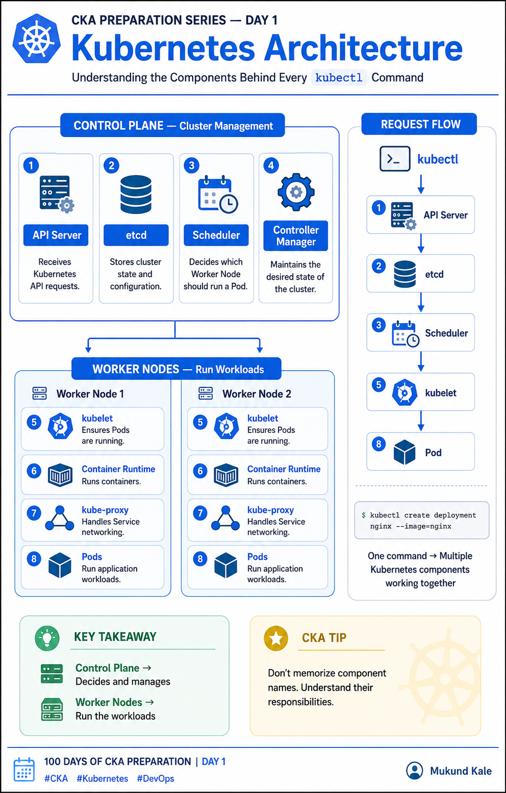

# 🚀 CKA Preparation Series — Day 1: Kubernetes Architecture

I’m starting my **100 Days of CKA Preparation** journey by learning Kubernetes in public.

### 🧩 Day 1 — Kubernetes Architecture

Before working with Pods, Deployments, Services, or troubleshooting, it’s important to understand **how a Kubernetes cluster is actually structured**.

A Kubernetes cluster mainly consists of:

### 🎛️ Control Plane

The control plane manages the overall state of the cluster.

Key components:

🔹 **kube-apiserver** — The entry point for Kubernetes API requests
🔹 **etcd** — Stores the cluster’s state and configuration
🔹 **kube-scheduler** — Decides which node should run a Pod
🔹 **kube-controller-manager** — Continuously works to maintain the desired state
🔹 **cloud-controller-manager** — Integrates Kubernetes with cloud-provider resources

### 🖥️ Worker Node

Worker nodes are where our application workloads actually run.

Important components:

🔹 **kubelet** — Communicates with the control plane and manages Pods
🔹 **Container Runtime** — Runs containers
🔹 **kube-proxy** — Helps implement Kubernetes Service networking

### 🔄 How it works

A simplified flow:

**kubectl → kube-apiserver → etcd / Scheduler / Controllers → Worker Node → kubelet → Container Runtime → Pod**

For example, when I run:

`kubectl create deployment nginx --image=nginx`

Kubernetes doesn't simply "run a container."

The request goes through the **API Server**, the desired state is recorded, the **controllers** create the required resources, the **scheduler** selects a suitable node, and the **kubelet** ensures the Pod actually runs there.

That separation of responsibilities is one of the key ideas behind Kubernetes.

### ⚠️ Common mistake

One thing I initially found easy to mix up:

**Scheduler ≠ kubelet**

👉 Scheduler decides **WHERE** a Pod should run.
👉 kubelet makes sure the Pod **actually runs** on that node.

### 🎯 CKA Exam Tip

Don't just memorize component names.

Understand **which component is responsible for what**. This becomes extremely useful when troubleshooting cluster and control-plane issues.

### 💡 What I learned today

Kubernetes is essentially a **desired-state system**.

I define what I want, and Kubernetes continuously works to make the actual state match that desired state.

That's the foundation I'm going to build on throughout this CKA journey.

📚 **Next:** Day 2 — Kubernetes Objects: Pods, Services, Deployments & ReplicaSets

I’ll be sharing what I learn, practical commands, troubleshooting scenarios, and CKA-focused tips throughout this series.

👉 Follow **Mukund Kale** if you're also preparing for CKA or learning Kubernetes.

#CKA #Kubernetes #DevOps #CloudComputing #KubernetesAdministrator #DevOpsJourney #LearningInPublic #100DaysOfCKA
# 🚀 CKA Preparation Series — Day 1: Kubernetes Architecture

I’m starting my **100 Days of CKA Preparation** journey by learning Kubernetes in public.

### 🧩 Day 1 — Kubernetes Architecture

Before working with Pods, Deployments, Services, or troubleshooting, it’s important to understand **how a Kubernetes cluster is actually structured**.

A Kubernetes cluster mainly consists of:

### 🎛️ Control Plane

The control plane manages the overall state of the cluster.

Key components:

🔹 **kube-apiserver** — The entry point for Kubernetes API requests
🔹 **etcd** — Stores the cluster’s state and configuration
🔹 **kube-scheduler** — Decides which node should run a Pod
🔹 **kube-controller-manager** — Continuously works to maintain the desired state
🔹 **cloud-controller-manager** — Integrates Kubernetes with cloud-provider resources

### 🖥️ Worker Node

Worker nodes are where our application workloads actually run.

Important components:

🔹 **kubelet** — Communicates with the control plane and manages Pods
🔹 **Container Runtime** — Runs containers
🔹 **kube-proxy** — Helps implement Kubernetes Service networking

### 🔄 How it works

A simplified flow:

**kubectl → kube-apiserver → etcd / Scheduler / Controllers → Worker Node → kubelet → Container Runtime → Pod**

For example, when I run:

`kubectl create deployment nginx --image=nginx`

Kubernetes doesn't simply "run a container."

The request goes through the **API Server**, the desired state is recorded, the **controllers** create the required resources, the **scheduler** selects a suitable node, and the **kubelet** ensures the Pod actually runs there.

That separation of responsibilities is one of the key ideas behind Kubernetes.

### ⚠️ Common mistake

One thing I initially found easy to mix up:

**Scheduler ≠ kubelet**

👉 Scheduler decides **WHERE** a Pod should run.
👉 kubelet makes sure the Pod **actually runs** on that node.

### 🎯 CKA Exam Tip

Don't just memorize component names.

Understand **which component is responsible for what**. This becomes extremely useful when troubleshooting cluster and control-plane issues.

### 💡 What I learned today

Kubernetes is essentially a **desired-state system**.

I define what I want, and Kubernetes continuously works to make the actual state match that desired state.

That's the foundation I'm going to build on throughout this CKA journey.

📚 **Next:** Day 2 — Kubernetes Objects: Pods, Services, Deployments & ReplicaSets

I’ll be sharing what I learn, practical commands, troubleshooting scenarios, and CKA-focused tips throughout this series.

👉 Follow **Mukund Kale** if you're also preparing for CKA or learning Kubernetes.

#CKA #Kubernetes #DevOps #CloudComputing #KubernetesAdministrator #DevOpsJourney #LearningInPublic #100DaysOfCKA

