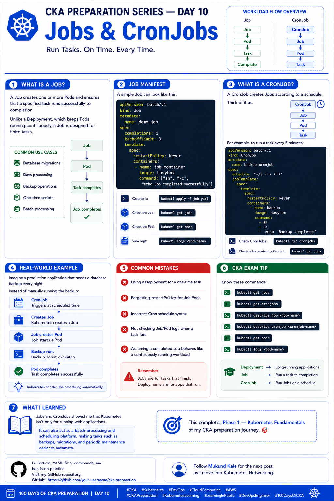

# 🚀 CKA Preparation Series — Day 10: Jobs & CronJobs

Continuing my **CKA Preparation Series | Learning Kubernetes in Public**.

Today I focused on **Jobs and CronJobs** — Kubernetes resources designed for **batch and scheduled workloads**.

This topic also helped me understand that Kubernetes isn't only designed for continuously running applications. It can also manage **finite tasks, batch processing, scheduled operations, backups, and maintenance jobs**.

---

## 🔹 What is a Job?

A **Job** creates one or more Pods and ensures that a specified task runs successfully to completion.

Unlike a Deployment, which manages long-running application Pods, a Job is designed for a **finite task**.

The basic flow is:

```text
Job
 ↓
Pod
 ↓
Task runs
 ↓
Task completes
 ↓
Job completes
```

Once the task successfully finishes, the Job is considered complete.

### Common use cases

Jobs are useful for tasks such as:

* Database migrations
* Data processing
* Backup operations
* One-time scripts
* Batch processing
* Report generation
* Data cleanup
* Initialization tasks

---

# 📝 Job Manifest

A simple Job can look like this:

```yaml
apiVersion: batch/v1
kind: Job
metadata:
  name: demo-job
spec:
  completions: 1
  backoffLimit: 3
  template:
    spec:
      restartPolicy: Never
      containers:
        - name: job-container
          image: busybox
          command: ["sh", "-c", "echo Job completed successfully"]
```

Let's break down some of the important fields.

### `completions`

```yaml
completions: 1
```

Defines how many successful Pod completions are required for the Job to be considered complete.

### `backoffLimit`

```yaml
backoffLimit: 3
```

Controls how many failed attempts Kubernetes will tolerate before the Job is considered failed.

### `restartPolicy`

```yaml
restartPolicy: Never
```

Job Pod templates require an appropriate restart policy such as `Never` or `OnFailure`.

---

# 🧪 Creating a Job

Save the manifest as:

```text
job.yaml
```

Then apply it:

```bash
kubectl apply -f job.yaml
```

Check the Job:

```bash
kubectl get jobs
```

Example:

```text
NAME        COMPLETIONS   DURATION   AGE
demo-job    1/1           5s         20s
```

---

# 🔍 Checking the Job Pod

A Job creates Pods to execute the task.

Check them with:

```bash
kubectl get pods
```

You may see:

```text
NAME              READY   STATUS      RESTARTS   AGE
demo-job-xxxxx    0/1     Completed   0          30s
```

A completed Pod is expected for a successful Job.

---

# 📜 Viewing Job Logs

To understand what happened inside the Job:

```bash
kubectl logs <pod-name>
```

For example:

```bash
kubectl logs demo-job-xxxxx
```

This is particularly useful when troubleshooting failed Jobs.

---

# 🔎 Describing a Job

For more detailed information:

```bash
kubectl describe job demo-job
```

The `Events` section can be particularly useful when a Job isn't behaving as expected.

---

# 🔹 What is a CronJob?

A **CronJob** creates Jobs according to a defined schedule.

The basic relationship is:

```text
CronJob
   ↓
  Job
   ↓
  Pod
   ↓
 Task
```

A CronJob is useful when a task needs to run **repeatedly at scheduled intervals**.

---

# ⏰ CronJob Schedule

For example, this schedule:

```text
*/5 * * * *
```

means:

> Run every 5 minutes.

A CronJob manifest could look like this:

```yaml
apiVersion: batch/v1
kind: CronJob
metadata:
  name: backup-cronjob
spec:
  schedule: "*/5 * * * *"
  jobTemplate:
    spec:
      template:
        spec:
          restartPolicy: Never
          containers:
            - name: backup
              image: busybox
              command:
                - sh
                - -c
                - echo "Backup completed"
```

---

# 🧪 Creating a CronJob

Save the manifest as:

```text
cronjob.yaml
```

Then:

```bash
kubectl apply -f cronjob.yaml
```

Check the CronJob:

```bash
kubectl get cronjobs
```

You can also use:

```bash
kubectl get cj
```

---

# 🔍 Checking Jobs Created by a CronJob

A CronJob creates Jobs according to its schedule.

Check them with:

```bash
kubectl get jobs
```

The relationship looks like:

```text
CronJob
   │
   ├── Job
   │     └── Pod
   │
   ├── Job
   │     └── Pod
   │
   └── Job
         └── Pod
```

Each scheduled execution creates a Job.

---

# 📊 Job vs CronJob vs Deployment

Understanding the difference between these resources is important for the CKA.

| Resource       | Purpose                           |
| -------------- | --------------------------------- |
| **Deployment** | Manages long-running applications |
| **Job**        | Runs a finite task to completion  |
| **CronJob**    | Creates Jobs on a schedule        |

A simple way to remember:

```text
Deployment
    ↓
Long-running workload


Job
    ↓
One-time / finite workload


CronJob
    ↓
Scheduled workload
    ↓
Job
```

---

# 🔥 Real-World Example: Database Backup

Imagine a production application that needs a database backup every night.

Instead of manually running the backup:

```text
CronJob
   ↓
Creates Job at scheduled time
   ↓
Job creates Pod
   ↓
Backup runs
   ↓
Pod completes
```

The CronJob handles the scheduling, while the Job handles the execution of the task.

This separation makes the workload easier to manage.

---

# ⚠️ Common Mistakes

### 1. Using a Deployment for a One-Time Task

A Deployment is designed for long-running workloads.

For a finite task, a **Job** is usually the appropriate resource.

---

### 2. Forgetting `restartPolicy`

Job Pod templates require:

```yaml
restartPolicy: Never
```

or:

```yaml
restartPolicy: OnFailure
```

---

### 3. Incorrect Cron Schedule

Cron syntax can be easy to get wrong.

For example:

```text
*/5 * * * *
```

means every 5 minutes.

Always verify the intended schedule before applying it.

---

### 4. Not Checking Logs

If a Job fails, don't just look at:

```bash
kubectl get jobs
```

Check the Pods and their logs:

```bash
kubectl get pods
kubectl logs <pod-name>
```

Logs can quickly reveal application or command failures.

---

### 5. Assuming Completed Jobs Behave Like Deployments

A completed Job isn't supposed to keep running.

For example:

```text
STATUS
------
Running
Completed
Failed
```

A successful Job reaching `Completed` is normal behavior.

---

# 🛠️ Useful Commands

## Jobs

List Jobs:

```bash
kubectl get jobs
```

Describe a Job:

```bash
kubectl describe job <job-name>
```

View Job YAML:

```bash
kubectl get job <job-name> -o yaml
```

Delete a Job:

```bash
kubectl delete job <job-name>
```

---

## CronJobs

List CronJobs:

```bash
kubectl get cronjobs
```

Short form:

```bash
kubectl get cj
```

Describe a CronJob:

```bash
kubectl describe cronjob <cronjob-name>
```

View CronJob YAML:

```bash
kubectl get cronjob <cronjob-name> -o yaml
```

Delete a CronJob:

```bash
kubectl delete cronjob <cronjob-name>
```

---

## Pods and Logs

List Pods:

```bash
kubectl get pods
```

View Pod details:

```bash
kubectl describe pod <pod-name>
```

View logs:

```bash
kubectl logs <pod-name>
```

---

# 🎯 CKA Exam Tips

For the CKA, I want to be comfortable with:

### Jobs

* Creating Jobs from YAML
* Understanding completions
* Understanding failed attempts
* Understanding `backoffLimit`
* Checking Job status
* Finding the Pod created by a Job
* Inspecting Pod logs

### CronJobs

* Creating CronJobs
* Understanding cron schedules
* Finding Jobs created by CronJobs
* Finding Pods created by Jobs
* Troubleshooting failed scheduled workloads

Useful commands to practice:

```bash
kubectl get jobs
kubectl get cronjobs
kubectl describe job <job-name>
kubectl describe cronjob <cronjob-name>
kubectl get pods
kubectl logs <pod-name>
```

---

# 🧠 Desired State & Batch Workloads

Jobs also reinforced the Kubernetes **desired-state and reconciliation model**.

For example:

```text
Desired:
1 successful completion
        ↓
Job creates Pod
        ↓
Task executes
        ↓
Task succeeds
        ↓
Job becomes Complete
```

If the task fails, Kubernetes can retry according to the Job configuration.

For a CronJob:

```text
CronJob
   ↓
Schedule reached
   ↓
Job created
   ↓
Pod created
   ↓
Task executes
   ↓
Job completes
```

This is a good example of how Kubernetes can manage more than just continuously running applications.

---

# 📚 What I Learned Today

Today I learned:

* What a Job is
* How Jobs create Pods
* How Jobs track successful completions
* How `backoffLimit` controls failed attempts
* Why Job Pods use `restartPolicy`
* What a CronJob is
* How CronJobs create Jobs on a schedule
* How to inspect Jobs and CronJobs
* How to troubleshoot failed batch workloads
* The difference between Deployments, Jobs, and CronJobs

### Key Takeaway

```text
Deployment → Long-running applications

Job → Run a task to completion

CronJob → Run Jobs on a schedule
```

Jobs and CronJobs showed me that Kubernetes isn't only for running web applications.

It can also act as a **batch-processing and scheduling platform**, making tasks such as backups, migrations, data processing, and periodic maintenance easier to automate.

---

# 🎯 Phase 1 Complete

This completes **Phase 1 — Kubernetes Fundamentals** of my CKA preparation journey. 🎯

The first phase helped me build a foundation around:

```text
Kubernetes Architecture
        ↓
Objects
        ↓
Pods
        ↓
YAML & kubectl
        ↓
Namespaces
        ↓
Labels & Selectors
        ↓
Annotations
        ↓
Deployments
        ↓
ReplicaSets
        ↓
Jobs & CronJobs
```

Now I'm ready to move into the next phase: **Kubernetes Networking**.

**Day 10 complete. ✅**

Next: **Phase 2 — Kubernetes Networking**

I'm continuing to learn Kubernetes by practicing each topic and documenting what I learn along the way.

---

## 📂 Repository Structure

```text
100DaysOfCKA/
├── Day-01-Kubernetes-Architecture/
├── Day-02-Kubernetes-Objects/
├── Day-03-Pods/
├── Day-04-YAML-kubectl/
├── Day-05-Namespaces/
├── Day-06-Labels-Selectors/
├── Day-07-Annotations/
├── Day-08-Deployments/
├── Day-09-ReplicaSets/
├── Day-10-Jobs-CronJobs/
│   ├── README.md
│   ├── job.yaml
│   └── cronjob.yaml
├── Day-11-Services/
└── images/
    ├── day1.png
    ├── day2.png
    ├── day3.png
    ├── day4.png
    ├── day5.png
    ├── day6.png
    ├── day7.png
    ├── day8.png
    ├── day9.png
    └── day10.png
```



---

## 🔗 Follow the Journey

Follow **Mukund Kale** for the next post in the **CKA Preparation Series**.

---

### 🏷️ Tags

`#CKA` `#Kubernetes` `#DevOps` `#CloudComputing` `#AWS` `#CKAPreparation` `#KubernetesLearning` `#LearningInPublic` `#DevOpsEngineer` `#100DaysOfCKA`
