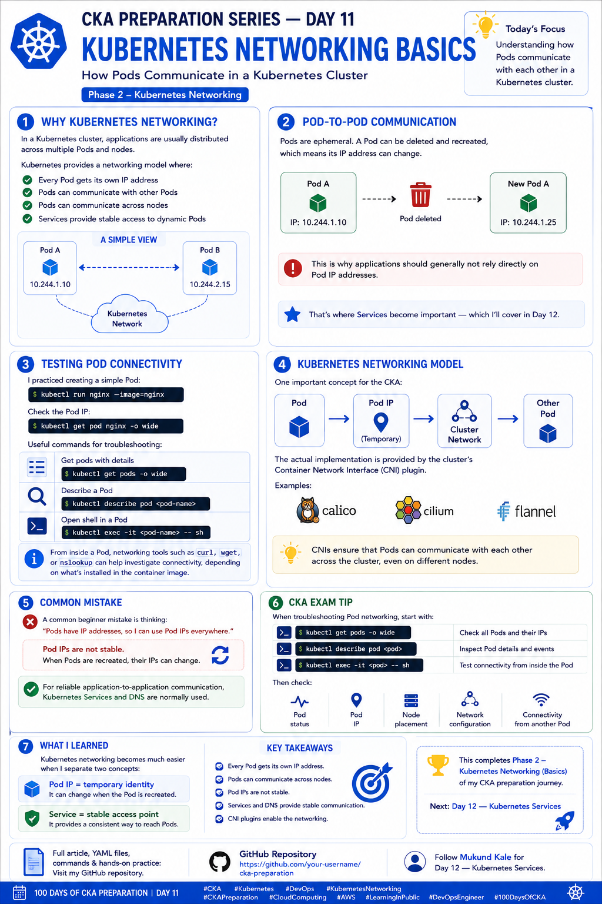

# 🚀 CKA Preparation Series — Day 11: Kubernetes Networking Basics

Continuing my **CKA Preparation Series | Learning Kubernetes in Public**.

Today I started **Phase 2 — Kubernetes Networking**, focusing on one of the most important Kubernetes fundamentals: **how Pods communicate with each other**.

---

## 📚 Day 11 — Kubernetes Networking Basics

Kubernetes networking is a critical topic for the CKA because applications running inside a cluster need to communicate reliably across **Pods, nodes, and Services**.

A simplified view:

```text
┌───────────────┐                 ┌───────────────┐
│    Pod A      │                 │    Pod B      │
│ 10.244.1.10   │ ──────────────> │ 10.244.2.15   │
└───────────────┘                 └───────────────┘
          \                             /
           \                           /
            └──── Kubernetes Network ─┘
```

---

# 🔹 Why Kubernetes Networking?

In a Kubernetes cluster, applications are usually distributed across multiple Pods and nodes.

For these applications to work together, Kubernetes provides a networking model where:

* ✅ Every Pod gets its own IP address
* ✅ Pods can communicate with other Pods
* ✅ Pods can communicate across nodes
* ✅ Services provide stable access to dynamic Pods
* ✅ Kubernetes DNS enables service discovery

The important idea is that Kubernetes provides a **cluster networking model**, while the actual networking implementation is handled by the cluster's CNI plugin.

---

# 🔹 Pod Networking

Every Pod receives its own IP address.

For example:

```text
Pod A
IP: 10.244.1.10

Pod B
IP: 10.244.2.15
```

Pod A should be able to communicate directly with Pod B:

```text
10.244.1.10
      │
      │ Network
      ▼
10.244.2.15
```

The exact Pod CIDR and networking implementation depend on the Kubernetes cluster configuration.

---

# 🔹 Pod-to-Pod Communication

One of the fundamental Kubernetes networking concepts is:

> **Pods should be able to communicate with other Pods without requiring NAT in the normal Pod networking model.**

For example:

```text
Node 1                              Node 2

┌──────────────┐                    ┌──────────────┐
│    Pod A     │                    │    Pod B     │
│ 10.244.1.10  │ ─────────────────> │ 10.244.2.15  │
└──────────────┘                    └──────────────┘
```

The networking layer provided by the cluster makes this communication possible even when the Pods are running on different nodes.

---

# ⚠️ Pod IPs Are Ephemeral

This was one of the most important things I focused on today.

Pods are **ephemeral**.

A Pod can be deleted and recreated, and the replacement Pod may receive a different IP address.

For example:

```text
Pod A
IP: 10.244.1.10
       │
       ▼
    Deleted
       │
       ▼
New Pod A
IP: 10.244.1.25
```

The application may still be the same, but its Pod IP has changed.

This is why applications should generally **not rely directly on Pod IP addresses** for long-term communication.

---

# 🔹 Pod IP vs Service IP

This leads to an important distinction:

```text
Pod IP
   ↓
Temporary / Dynamic
```

versus:

```text
Service
   ↓
Stable access point
   ↓
Pods
```

For example:

```text
             Service
          10.96.10.100
                │
       ┌────────┼────────┐
       ▼        ▼        ▼
     Pod A    Pod B    Pod C
     IP-1     IP-2     IP-3
```

If Pod B is deleted and replaced, the Service can continue directing traffic to the available matching Pods.

I'll explore this in more detail in **Day 12 — Kubernetes Services**.

---

# 🧪 Creating a Test Pod

I practiced creating a simple Nginx Pod:

```bash
kubectl run nginx --image=nginx
```

Check the Pod:

```bash
kubectl get pods
```

To see the Pod IP and node:

```bash
kubectl get pod nginx -o wide
```

Example:

```text
NAME    READY   STATUS    IP            NODE
nginx   1/1     Running   10.244.1.10   worker-01
```

The `-o wide` output is particularly useful when troubleshooting Kubernetes networking.

---

# 🔍 Inspecting Pod Networking

Some useful commands I practiced:

### Get Pod IP and Node

```bash
kubectl get pods -o wide
```

### Describe a Pod

```bash
kubectl describe pod <pod-name>
```

### Check Pod YAML

```bash
kubectl get pod <pod-name> -o yaml
```

### Enter a Running Pod

```bash
kubectl exec -it <pod-name> -- sh
```

Once inside the container, networking tools such as:

```bash
curl
wget
nslookup
```

can be useful for connectivity testing, depending on what is installed in the container image.

---

# 🧪 Testing Connectivity Between Pods

A useful troubleshooting exercise is to create two Pods.

For example:

```bash
kubectl run nginx --image=nginx
```

Then:

```bash
kubectl run busybox --image=busybox --command -- sleep 3600
```

Check their IP addresses:

```bash
kubectl get pods -o wide
```

Then enter the BusyBox Pod:

```bash
kubectl exec -it busybox -- sh
```

From inside the Pod, connectivity can be tested against another Pod's IP using an appropriate tool available in the image.

For example, if `wget` is available:

```bash
wget -O- http://<pod-ip>
```

This is a useful hands-on exercise for understanding basic Pod-to-Pod communication.

---

# 🔹 Kubernetes Networking Model

A simplified Kubernetes networking model looks like:

```text
Application
     │
     ▼
   Pod
     │
     ▼
  Pod IP
     │
     ▼
Cluster Network
     │
     ▼
Other Pod
```

The networking implementation is provided by a **Container Network Interface (CNI)** plugin.

Common CNI implementations include:

* **Calico**
* **Cilium**
* **Flannel**

The CNI plugin is responsible for implementing the networking behavior required by the cluster.

---

# 🔹 What is CNI?

**CNI** stands for:

> **Container Network Interface**

It is a standard for configuring networking for containers.

In Kubernetes, the CNI plugin is responsible for providing the networking connectivity required by Pods.

A simplified view:

```text
Kubernetes
     │
     ▼
   CNI
     │
     ├── Pod Networking
     ├── IP Address Management
     └── Network Connectivity
```

Different Kubernetes environments can use different CNI implementations.

---

# 🔹 Node-to-Node Pod Communication

Pods can run on different nodes.

For example:

```text
Node 1                              Node 2
┌──────────────┐                  ┌──────────────┐
│    Pod A     │                  │    Pod B     │
│ 10.244.1.10  │ ───────────────> │ 10.244.2.15  │
└──────────────┘                  └──────────────┘
```

The cluster networking implementation is responsible for making this communication possible.

This is important in real Kubernetes environments because workloads are constantly being scheduled across different nodes.

---

# ⚠️ Common Mistake

A common beginner mistake is thinking:

> "Pods have IP addresses, so I can use Pod IPs everywhere."

Pod IPs are **not stable identities**.

If a Pod is recreated:

```text
Old Pod
10.244.1.10
     ↓
   Deleted
     ↓
New Pod
10.244.1.25
```

The IP can change.

For reliable application communication, Kubernetes normally uses:

```text
Service
   ↓
Stable access
   ↓
Pod(s)
```

and Kubernetes DNS can provide a stable name for Services.

---

# 🔍 Networking Troubleshooting Workflow

When troubleshooting Pod networking, I want to follow a systematic approach.

### 1. Check Pod status

```bash
kubectl get pods
```

Look for:

```text
Running
Pending
ContainerCreating
CrashLoopBackOff
```

---

### 2. Check Pod IP and Node

```bash
kubectl get pods -o wide
```

Check:

* Pod IP
* Node
* Status
* Readiness

---

### 3. Describe the Pod

```bash
kubectl describe pod <pod-name>
```

Pay attention to:

* Events
* Network-related errors
* Container status
* Pod conditions

---

### 4. Enter the Pod

```bash
kubectl exec -it <pod-name> -- sh
```

Then test connectivity using available tools.

---

### 5. Check the CNI / Cluster Networking

If multiple Pods have networking problems, the issue may not be inside the application container.

It may involve:

* CNI configuration
* Node networking
* IP address allocation
* Network policies
* Routing

This is where understanding the cluster's networking architecture becomes important.

---

# 🎯 CKA Exam Tips

For the CKA, I want to be comfortable with:

### Understand

* Pod IP addresses
* Pod-to-Pod communication
* Cross-node Pod communication
* Pod IP vs Service IP
* CNI
* Basic network troubleshooting
* Why Pod IPs should not be treated as permanent identities

### Practice

```bash
kubectl get pods -o wide
kubectl describe pod <pod-name>
kubectl exec -it <pod-name> -- sh
kubectl get pod <pod-name> -o yaml
```

Also practice identifying:

```text
Pod
 ↓
Pod IP
 ↓
Node
 ↓
Cluster Network
 ↓
Other Pod
```

---

# 🧠 Day 11 Takeaway

The biggest takeaway for me today was:

> **Pod IPs are temporary, while Services provide stable access to Pods.**

A simple mental model:

```text
Pod
 │
 └── Pod IP
       │
       └── Temporary


Service
 │
 └── Stable endpoint
       │
       └── Selects Pods
```

Understanding this foundation will make **Services, DNS, Ingress, and NetworkPolicies** much easier to understand.

---

# 📚 What I Learned Today

Today I learned:

* Why Kubernetes networking is important
* How Pods receive IP addresses
* How Pod-to-Pod communication works conceptually
* How Pods can communicate across nodes
* Why Pod IPs are ephemeral
* How to inspect Pod networking
* How to test connectivity from a Pod
* What CNI means
* Examples of CNI implementations
* The difference between Pod IPs and stable Service access
* A basic Kubernetes networking troubleshooting workflow

**Day 11 complete. ✅**

Next: **Day 12 — Kubernetes Services: ClusterIP, NodePort & Service Discovery**

---

# 📂 Repository Structure

```text
100DaysOfCKA/
├── Day-01-Kubernetes-Architecture/
├── Day-02-Kubernetes-Objects/
├── Day-03-Pods/
├── Day-04-YAML-kubectl/
├── Day-05-Namespaces/
├── Day-06-Labels-Selectors/
├── Day-07-Annotations/
├── Day-08-Deployments/
├── Day-09-ReplicaSets/
├── Day-10-Jobs-CronJobs/
├── Day-11-Kubernetes-Networking/
│   ├── README.md
│   └── pod-networking.yaml
├── Day-12-Services/
└── images/
    ├── day1.png
    ├── day2.png
    ├── day3.png
    ├── day4.png
    ├── day5.png
    ├── day6.png
    ├── day7.png
    ├── day8.png
    ├── day9.png
    ├── day10.png
    └── day11.png
```



---

# 🔗 Follow the Journey

I'm continuing to learn Kubernetes by practicing each topic and documenting what I learn along the way.

Follow **Mukund Kale** for **Day 12 — Kubernetes Services**.

📂 **GitHub — CKA Preparation Repository**

[https://github.com/Mukund15kale/100DaysOfCKA](https://github.com/Mukund15kale/100DaysOfCKA)

---

## 🏷️ Tags

`#CKA` `#Kubernetes` `#DevOps` `#KubernetesNetworking` `#CKAPreparation` `#CloudComputing` `#AWS` `#LearningInPublic` `#DevOpsEngineer` `#100DaysOfCKA`
