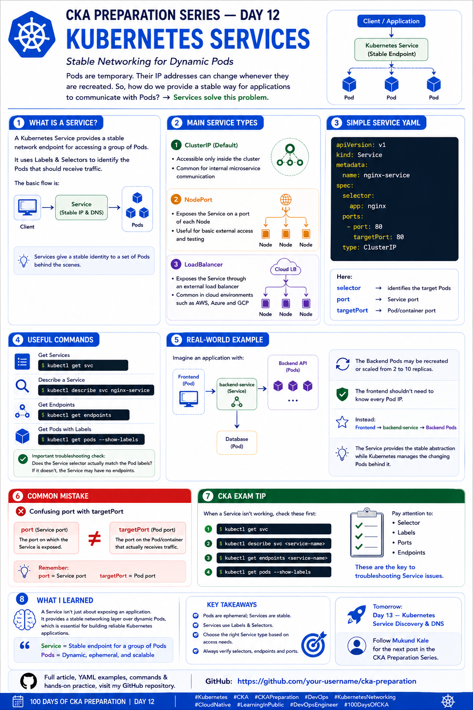

# 🚀 CKA Preparation Series — Day 12: Kubernetes Services

Continuing my **CKA Preparation Series | Learning Kubernetes in Public**.

Today I focused on **Kubernetes Services** — one of the most important networking concepts in Kubernetes.

In the previous topic, I learned that Pods have their own IP addresses, but Pods are **ephemeral**. When a Pod is deleted and recreated, its IP address can change.

So the question becomes:

> How can applications communicate with Pods without depending on constantly changing Pod IP addresses?

👉 **Kubernetes Services solve this problem.**

---

# 📚 What is a Kubernetes Service?

A **Service** provides a stable network endpoint for accessing a group of Pods.

Instead of connecting directly to individual Pod IP addresses, clients communicate with a Service.

The Service then routes traffic to the appropriate backend Pods.

The basic flow is:

```text
Client
   │
   ▼
Service
   │
   ├──────► Pod
   ├──────► Pod
   └──────► Pod
```

This gives applications a stable networking abstraction even when Pods are:

* Created
* Deleted
* Recreated
* Rescheduled
* Scaled up
* Scaled down

---

# 🔹 How Does a Service Find Pods?

Services use **Labels and Selectors** to identify their backend Pods.

For example, suppose the Pods have:

```yaml
metadata:
  labels:
    app: nginx
```

The Service can use:

```yaml
selector:
  app: nginx
```

The relationship becomes:

```text
Pod Labels
    ↓
app: nginx
    ↑
Service Selector
```

The Service selects Pods whose labels match its selector.

---

# 🧪 Creating Pods for a Service

Let's create an Nginx Deployment first:

```bash
kubectl create deployment nginx --image=nginx --replicas=3
```

Check the Pods:

```bash
kubectl get pods --show-labels
```

We should see Pods with a label similar to:

```text
app=nginx
```

---

# 🔹 Creating a ClusterIP Service

We can expose the Deployment using:

```bash
kubectl expose deployment nginx \
  --name=nginx-service \
  --port=80 \
  --target-port=80
```

Check the Service:

```bash
kubectl get svc
```

Example:

```text
NAME            TYPE        CLUSTER-IP      PORT(S)
nginx-service   ClusterIP   10.96.100.10    80/TCP
```

The Service now provides a stable endpoint for the Nginx Pods.

---

# 📝 Service YAML

The same Service can be defined declaratively using YAML:

```yaml
apiVersion: v1
kind: Service
metadata:
  name: nginx-service
spec:
  selector:
    app: nginx
  ports:
    - protocol: TCP
      port: 80
      targetPort: 80
  type: ClusterIP
```

Apply it:

```bash
kubectl apply -f service.yaml
```

---

# 🔍 Understanding the Service YAML

There are several important fields here.

## `selector`

```yaml
selector:
  app: nginx
```

This tells Kubernetes:

> Send traffic to Pods with the label `app=nginx`.

---

## `port`

```yaml
port: 80
```

This is the port exposed by the **Service**.

Think:

```text
Client → Service:80
```

---

## `targetPort`

```yaml
targetPort: 80
```

This is the port on the **backend Pod** where the traffic is sent.

So:

```text
Service
Port: 80
   │
   ▼
Pod
TargetPort: 80
```

### Easy way to remember:

```text
port       → Service port
targetPort → Pod/application port
```

---

# 🔹 Main Kubernetes Service Types

The main Service types I focused on are:

1. **ClusterIP**
2. **NodePort**
3. **LoadBalancer**

---

# 1️⃣ ClusterIP

**ClusterIP** is the default Service type.

It provides access to the application **inside the Kubernetes cluster**.

Example:

```yaml
type: ClusterIP
```

Traffic flow:

```text
Pod / Application
       │
       ▼
ClusterIP Service
       │
       ▼
Backend Pods
```

This is commonly used for internal microservice communication.

For example:

```text
Frontend Pod
     │
     ▼
backend-service
     │
     ▼
Backend Pods
```

The frontend doesn't need to know the IP address of every backend Pod.

---

# 2️⃣ NodePort

A **NodePort** exposes the Service on a port on each Kubernetes Node.

Example:

```yaml
apiVersion: v1
kind: Service
metadata:
  name: nginx-nodeport
spec:
  selector:
    app: nginx
  ports:
    - port: 80
      targetPort: 80
      nodePort: 30080
  type: NodePort
```

Traffic can conceptually flow like:

```text
External Client
      │
      ▼
Node IP:30080
      │
      ▼
NodePort Service
      │
      ▼
Nginx Pods
```

NodePort values are normally within the Kubernetes NodePort range, commonly `30000-32767`.

---

# 3️⃣ LoadBalancer

A **LoadBalancer** Service requests an external load balancer from a cloud provider or supported infrastructure.

Example:

```yaml
apiVersion: v1
kind: Service
metadata:
  name: nginx-loadbalancer
spec:
  selector:
    app: nginx
  ports:
    - port: 80
      targetPort: 80
  type: LoadBalancer
```

In a cloud environment, this can result in an externally accessible load-balancing endpoint.

For example:

```text
Internet
    │
    ▼
Cloud Load Balancer
    │
    ▼
Kubernetes Service
    │
    ▼
Nginx Pods
```

This is commonly used in cloud-based Kubernetes environments.

---

# 📊 Service Types Comparison

| Service Type     | Accessibility          | Common Use                    |
| ---------------- | ---------------------- | ----------------------------- |
| **ClusterIP**    | Internal cluster       | Microservice communication    |
| **NodePort**     | Node IP + port         | Basic external access/testing |
| **LoadBalancer** | External load balancer | Cloud-based applications      |

A simple way to remember:

```text
ClusterIP
   ↓
Inside cluster

NodePort
   ↓
Node IP + Port

LoadBalancer
   ↓
External Load Balancer
```

---

# 🔹 Service and Pod IPs

This is where Services become particularly useful.

Imagine three Pods:

```text
Pod A → 10.244.1.10
Pod B → 10.244.1.11
Pod C → 10.244.1.12
```

A Service provides a stable endpoint:

```text
backend-service
       │
       ├──────► Pod A
       ├──────► Pod B
       └──────► Pod C
```

If Pod B is deleted:

```text
Pod B → Deleted
```

and Kubernetes creates:

```text
New Pod → 10.244.2.20
```

the Service can continue selecting the appropriate backend Pod based on labels.

The client doesn't need to know about the Pod replacement.

---

# 🧠 Real-World Example

Imagine a typical microservices architecture:

```text
              Frontend
                  │
                  ▼
          backend-service
                  │
        ┌─────────┼─────────┐
        ▼         ▼         ▼
    Backend     Backend    Backend
      Pod         Pod        Pod
```

Initially:

```text
2 Backend Pods
```

Later, traffic increases:

```text
10 Backend Pods
```

The frontend still communicates with:

```text
backend-service
```

It doesn't need to track all 10 Pod IP addresses.

This is one of the key benefits of Services.

---

# 🔍 Service Endpoints

One of the most useful troubleshooting concepts is understanding **Endpoints / EndpointSlices**.

A Service may exist and look healthy:

```bash
kubectl get svc
```

but it might not have any backend Pods selected.

Check:

```bash
kubectl get endpoints
```

Or for a specific Service:

```bash
kubectl get endpoints nginx-service
```

You can also inspect EndpointSlices:

```bash
kubectl get endpointslices
```

The important question is:

> **Does the Service actually have backend endpoints?**

---

# ⚠️ Common Service Problem

Suppose my Pods have:

```yaml
labels:
  app: nginx
```

But my Service has:

```yaml
selector:
  app: web
```

The labels don't match.

Therefore:

```text
Service Selector
      ↓
app=web

Pod Labels
      ↓
app=nginx

❌ No Match
```

The Service may have no backend endpoints.

This can lead to confusing connectivity problems.

---

# 🛠️ Service Troubleshooting Workflow

When a Service isn't working, I want to check the following.

### 1. Check the Service

```bash
kubectl get svc
```

---

### 2. Describe the Service

```bash
kubectl describe svc <service-name>
```

Look for:

* Selector
* Port
* TargetPort
* Endpoints
* Events

---

### 3. Check Pod Labels

```bash
kubectl get pods --show-labels
```

Compare the Pod labels with the Service selector.

---

### 4. Check Endpoints

```bash
kubectl get endpoints <service-name>
```

If there are no endpoints, investigate the selector and Pod readiness.

---

### 5. Check EndpointSlices

```bash
kubectl get endpointslices
```

For more details:

```bash
kubectl describe endpointslice <name>
```

---

### 6. Check Pod Status

```bash
kubectl get pods -o wide
```

Make sure the backend Pods are actually running and ready.

---

# 🔎 Useful Commands

### List Services

```bash
kubectl get svc
```

### Short form

```bash
kubectl get service
```

### Describe Service

```bash
kubectl describe svc <service-name>
```

### View Service YAML

```bash
kubectl get svc <service-name> -o yaml
```

### Get Endpoints

```bash
kubectl get endpoints
```

### Get EndpointSlices

```bash
kubectl get endpointslices
```

### Show Pod Labels

```bash
kubectl get pods --show-labels
```

### Get Pods with their IPs

```bash
kubectl get pods -o wide
```

---

# 🧪 Hands-On Practice

A useful exercise is to create a Deployment and expose it using a Service.

### Step 1 — Create Deployment

```bash
kubectl create deployment nginx --image=nginx --replicas=3
```

### Step 2 — Check Pods

```bash
kubectl get pods -o wide
```

### Step 3 — Create Service

```bash
kubectl expose deployment nginx \
  --name=nginx-service \
  --port=80 \
  --target-port=80
```

### Step 4 — Check Service

```bash
kubectl get svc
```

### Step 5 — Check Endpoints

```bash
kubectl get endpoints nginx-service
```

### Step 6 — Inspect the Service

```bash
kubectl describe svc nginx-service
```

This exercise helped me connect:

```text
Deployment
     ↓
Pods
     ↓
Labels
     ↓
Service Selector
     ↓
Service
     ↓
Endpoints
```

---

# ⚠️ Common Mistakes

### ❌ Confusing `port` and `targetPort`

Remember:

```text
port
 ↓
Service port

targetPort
 ↓
Pod/application port
```

---

### ❌ Service Selector Doesn't Match Pod Labels

Check:

```bash
kubectl get pods --show-labels
```

and:

```bash
kubectl describe svc <service-name>
```

---

### ❌ Assuming Service Automatically Finds Every Pod

A Service only selects Pods that match its selector.

```text
Service Selector
      ↓
Matching Pod Labels
      ↓
Endpoints
```

---

### ❌ Forgetting the Namespace

Services are namespaced resources.

If the Service and Pods are in different namespaces, they won't form the expected Service-to-Pod relationship.

Check:

```bash
kubectl get svc -A
kubectl get pods -A
```

---

# 🎯 CKA Exam Tips

When troubleshooting a Service, I want to immediately check:

```bash
kubectl get svc
kubectl describe svc <service-name>
kubectl get endpoints <service-name>
kubectl get endpointslices
kubectl get pods --show-labels
kubectl get pods -o wide
```

Pay special attention to:

```text
1. Service selector
2. Pod labels
3. Service port
4. targetPort
5. Pod readiness
6. Endpoints
7. Namespace
```

A perfectly valid Service YAML can still fail to route traffic if the **selector doesn't match the backend Pod labels**.

---

# 🧠 Day 12 Takeaway

The biggest takeaway for me today is:

> **A Service provides stable networking over dynamic Pods.**

The mental model I want to remember is:

```text
Client
   │
   ▼
Service
   │
   │ Selector
   ▼
Matching Pods
   │
   ├── Pod
   ├── Pod
   └── Pod
```

And:

```text
Pod IP
   ↓
Dynamic

Service
   ↓
Stable access
```

This abstraction is essential for building reliable Kubernetes applications.

---

# 📚 What I Learned Today

Today I learned:

* What a Kubernetes Service is
* Why Services are needed
* How Services use Labels and Selectors
* ClusterIP
* NodePort
* LoadBalancer
* The difference between `port` and `targetPort`
* How Services connect to backend Pods
* What Endpoints and EndpointSlices represent
* How to troubleshoot a Service
* Why Pod IPs shouldn't be used as stable application endpoints
* How Services fit into Kubernetes networking

### Key Takeaway

```text
Pod IP       → Dynamic
Service      → Stable access
Selector     → Finds matching Pods
Endpoints    → Backend addresses
```

**Day 12 complete. ✅**

Next: **Day 13 — Kubernetes Service Discovery & DNS**

I'm continuing to learn Kubernetes by practicing each topic and documenting what I learn along the way.

---

# 📂 Repository Structure

```text
100DaysOfCKA/
├── Day-01-Kubernetes-Architecture/
├── Day-02-Kubernetes-Objects/
├── Day-03-Pods/
├── Day-04-YAML-kubectl/
├── Day-05-Namespaces/
├── Day-06-Labels-Selectors/
├── Day-07-Annotations/
├── Day-08-Deployments/
├── Day-09-ReplicaSets/
├── Day-10-Jobs-CronJobs/
├── Day-11-Kubernetes-Networking/
├── Day-12-Kubernetes-Services/
│   ├── README.md
│   ├── deployment.yaml
│   └── service.yaml
├── Day-13-Service-Discovery-DNS/
└── images/
    ├── day1.png
    ├── day2.png
    ├── day3.png
    ├── day4.png
    ├── day5.png
    ├── day6.png
    ├── day7.png
    ├── day8.png
    ├── day9.png
    ├── day10.png
    ├── day11.png
    └── day12.png
```



---

# 🔗 Follow the Journey

I'm continuing to learn Kubernetes by practicing each topic and documenting what I learn along the way.

Follow **Mukund Kale** for **Day 13 — Kubernetes Service Discovery & DNS**.

📚 **GitHub — CKA Preparation Repository**

[https://github.com/Mukund15kale/100DaysOfCKA](https://github.com/Mukund15kale/100DaysOfCKA)

---

## 🏷️ Tags

`#Kubernetes` `#CKA` `#CKAPreparation` `#DevOps` `#KubernetesNetworking` `#CloudNative` `#LearningInPublic` `#DevOpsEngineer` `#100DaysOfCKA`
