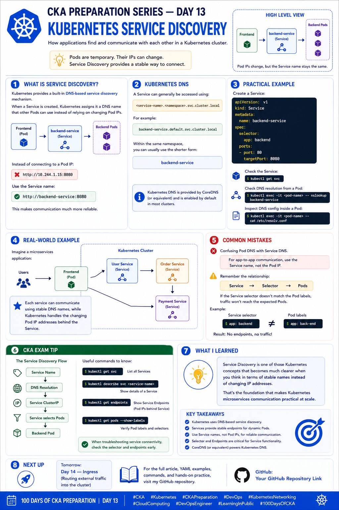

# 🚀 CKA Preparation Series — Day 13: Kubernetes Service Discovery

Continuing my **CKA Preparation Series | Learning Kubernetes in Public**.

Today I focused on **Kubernetes Service Discovery** — an important concept for understanding how applications communicate with each other inside a Kubernetes cluster.

In Day 12, I learned that a **Service provides stable access to dynamic Pods**.

Today, I went one step further:

> **How does one application find another application inside the cluster?**

👉 **Kubernetes Service Discovery and DNS solve this problem.**

---

# 📚 Day 13 — Service Discovery

## 🔹 What is Service Discovery?

Service discovery is the mechanism that allows applications to **find and communicate with other services without needing to know their changing Pod IP addresses**.

Because Pods are ephemeral, their IP addresses can change.

For example:

```text
Backend Pod
10.244.1.15
     ↓
   Deleted
     ↓
New Backend Pod
10.244.2.25
```

If the frontend application directly used:

```text
10.244.1.15
```

communication could break when the Pod is recreated.

Instead, Kubernetes provides a stable **Service**:

```text
Frontend
    │
    ▼
backend-service
    │
    ▼
Backend Pods
```

The frontend can communicate with:

```text
backend-service
```

rather than tracking individual Pod IP addresses.

---

# 🔹 Kubernetes DNS

Kubernetes provides a built-in **DNS-based service discovery mechanism**.

When a Service is created, Kubernetes DNS makes it possible for Pods to resolve the Service using a DNS name.

For example:

```text
backend-service
```

Within the same namespace, this short name is generally sufficient.

A fully qualified Service DNS name follows this pattern:

```text
<service-name>.<namespace>.svc.cluster.local
```

For example:

```text
backend-service.default.svc.cluster.local
```

The general structure is:

```text
Service Name
      .
Namespace
      .
svc
      .
cluster.local
```

---

# 🔹 Service DNS Example

Suppose we have:

```text
Service:
backend-service

Namespace:
default
```

The Service can be reached using:

```text
backend-service
```

or:

```text
backend-service.default.svc.cluster.local
```

Both ultimately identify the same Kubernetes Service, assuming normal cluster DNS configuration.

---

# 🧠 Short Name vs Fully Qualified Name

A useful mental model:

### Same Namespace

```text
backend-service
```

### Different Namespace

```text
backend-service.production
```

### Fully Qualified Domain Name

```text
backend-service.production.svc.cluster.local
```

This becomes particularly useful when applications are distributed across multiple namespaces.

---

# 🔹 Service Discovery Flow

The overall process looks like this:

```text
Frontend Pod
     │
     │ DNS query
     ▼
Kubernetes DNS
     │
     ▼
backend-service
     │
     ▼
Service ClusterIP
     │
     ▼
Backend Pods
```

A simplified application flow:

```text
Frontend
   │
   │ http://backend-service
   ▼
Service
   │
   ├────────► Backend Pod
   ├────────► Backend Pod
   └────────► Backend Pod
```

The frontend doesn't need to know the individual backend Pod IP addresses.

---

# 🔹 Creating a Backend Service

Let's create a simple backend Deployment:

```bash
kubectl create deployment backend \
  --image=nginx \
  --replicas=3
```

Check the Pods:

```bash
kubectl get pods --show-labels
```

The Pods will have a label similar to:

```text
app=backend
```

Now create a Service:

```bash
kubectl expose deployment backend \
  --name=backend-service \
  --port=80 \
  --target-port=80
```

Check it:

```bash
kubectl get svc
```

Example:

```text
NAME              TYPE        CLUSTER-IP      PORT(S)
backend-service   ClusterIP   10.96.100.20    80/TCP
```

Now the Service has a stable name:

```text
backend-service
```

---

# 📝 Service YAML

The same Service can be created declaratively:

```yaml
apiVersion: v1
kind: Service
metadata:
  name: backend-service
spec:
  selector:
    app: backend
  ports:
    - protocol: TCP
      port: 80
      targetPort: 80
  type: ClusterIP
```

Apply it:

```bash
kubectl apply -f backend-service.yaml
```

---

# 🔍 Testing DNS Resolution

To test Kubernetes DNS, we need a Pod containing a DNS utility such as `nslookup`.

For example:

```bash
kubectl run dns-test \
  --image=busybox:1.36 \
  --restart=Never \
  --command -- sleep 3600
```

Enter the Pod:

```bash
kubectl exec -it dns-test -- sh
```

Now test:

```bash
nslookup backend-service
```

You can also test the fully qualified name:

```bash
nslookup backend-service.default.svc.cluster.local
```

If DNS is working correctly, the Service should resolve to its Service IP.

---

# 🔹 Inspect `/etc/resolv.conf`

Another useful troubleshooting technique is checking the DNS configuration inside a Pod.

Run:

```bash
kubectl exec -it dns-test -- cat /etc/resolv.conf
```

You may see configuration similar to:

```text
search default.svc.cluster.local svc.cluster.local cluster.local
nameserver 10.96.0.10
options ndots:5
```

The exact values depend on the cluster configuration.

The important part is the `nameserver`.

It points the Pod toward the cluster's DNS service.

---

# 🧠 Understanding `/etc/resolv.conf`

The Pod's DNS configuration helps determine how DNS queries are resolved.

For example, with a search domain such as:

```text
default.svc.cluster.local
```

a query for:

```text
backend-service
```

can be expanded to:

```text
backend-service.default.svc.cluster.local
```

This is why applications can often use short Service names instead of the full DNS name.

---

# 🔹 Kubernetes DNS Architecture

At a high level:

```text
                 Kubernetes Cluster
                        │
                        ▼
                 DNS Service
                        │
                        ▼
                   CoreDNS
                        │
              ┌─────────┴─────────┐
              ▼                   ▼
       Service Records       Other DNS
              │
              ▼
      backend-service
              │
              ▼
         Service IP
```

In many Kubernetes clusters, **CoreDNS** provides the cluster DNS service.

CoreDNS watches Kubernetes resources and provides DNS records for Services and other supported Kubernetes DNS records.

---

# 🔹 Service → DNS → Service IP

For a normal ClusterIP Service, the conceptual flow is:

```text
Application
     │
     │ DNS Query
     ▼
backend-service
     │
     ▼
Cluster DNS
     │
     ▼
Service ClusterIP
     │
     ▼
Service
     │
     ▼
Backend Pods
```

This gives applications a stable name even though the backend Pods can change.

---

# 🔹 Real-World Microservices Example

Consider a microservices application:

```text
                     Kubernetes Cluster

                         Frontend
                            │
                            │
                            ▼
                    user-service
                            │
                            ▼
                     User Service
                         Pods
                            │
                            ▼
                    order-service
                            │
                            ▼
                     Order Service
                         Pods
                            │
                            ▼
                   payment-service
                            │
                            ▼
                    Payment Service
                         Pods
```

The frontend might communicate with:

```text
user-service
```

The User Service might communicate with:

```text
order-service
```

The Order Service might communicate with:

```text
payment-service
```

Applications don't need to maintain a list of backend Pod IP addresses.

Instead:

```text
Service Name
     ↓
DNS Resolution
     ↓
Service
     ↓
Backend Pods
```

This is one of the reasons Kubernetes works well for microservices architectures.

---

# 🔹 Cross-Namespace Service Discovery

Suppose we have:

```text
Namespace: development
Service: backend-service
```

Another Pod in a different namespace can reference it using:

```text
backend-service.development
```

Or the fully qualified name:

```text
backend-service.development.svc.cluster.local
```

For example:

```text
frontend.production
       │
       ▼
backend-service.development
       │
       ▼
Backend Pods
```

This is useful when multiple environments or teams use different namespaces.

---

# ⚠️ Common Mistake: Pod IP vs Service DNS

One mistake is directly using:

```text
10.244.1.15
```

for application communication.

Pod IPs can change.

Instead, use:

```text
backend-service
```

or:

```text
backend-service.default.svc.cluster.local
```

This gives applications a stable naming mechanism.

---

# ⚠️ Common Mistake: Service Selector

DNS can resolve correctly while the application still fails to reach the backend.

Why?

Because DNS only helps find the **Service**.

The Service still needs to find the correct Pods.

Remember:

```text
DNS
 ↓
Service
 ↓
Selector
 ↓
Pods
```

For example:

Pod:

```yaml
labels:
  app: backend
```

Service:

```yaml
selector:
  app: backend
```

✅ Correct match.

But:

```yaml
selector:
  app: web
```

❌ No matching backend Pods.

Therefore, when troubleshooting, don't stop after confirming DNS resolution.

---

# 🔍 Service Discovery Troubleshooting

When an application cannot communicate with a Service, I want to troubleshoot systematically.

---

## 1. Check the Service

```bash
kubectl get svc
```

Check:

* Service name
* Type
* ClusterIP
* Port

---

## 2. Describe the Service

```bash
kubectl describe svc <service-name>
```

Pay attention to:

```text
Selector
Port
TargetPort
Endpoints
```

---

## 3. Check Endpoints

```bash
kubectl get endpoints <service-name>
```

If the Service has no endpoints, investigate:

* Pod labels
* Service selector
* Pod readiness
* Namespace

---

## 4. Check EndpointSlices

```bash
kubectl get endpointslices
```

For a specific EndpointSlice:

```bash
kubectl describe endpointslice <name>
```

---

## 5. Check Pod Labels

```bash
kubectl get pods --show-labels
```

Compare:

```text
Service selector
       ↓
Pod labels
```

They need to match appropriately.

---

## 6. Test DNS

From a Pod:

```bash
kubectl exec -it <pod-name> -- nslookup <service-name>
```

For example:

```bash
kubectl exec -it dns-test -- nslookup backend-service
```

---

## 7. Check DNS Configuration

```bash
kubectl exec -it <pod-name> -- cat /etc/resolv.conf
```

---

## 8. Check CoreDNS

Check the DNS Pods:

```bash
kubectl get pods -n kube-system
```

Depending on the cluster configuration, look for CoreDNS Pods.

You can also inspect them with:

```bash
kubectl get pods -n kube-system -l k8s-app=kube-dns
```

And check logs:

```bash
kubectl logs -n kube-system -l k8s-app=kube-dns
```

---

# 🧪 Hands-On Lab

Here's a simple exercise I can use to practice Service Discovery.

### Step 1 — Create Backend Deployment

```bash
kubectl create deployment backend \
  --image=nginx \
  --replicas=3
```

---

### Step 2 — Create Service

```bash
kubectl expose deployment backend \
  --name=backend-service \
  --port=80 \
  --target-port=80
```

---

### Step 3 — Check Service

```bash
kubectl get svc backend-service
```

---

### Step 4 — Check Endpoints

```bash
kubectl get endpoints backend-service
```

---

### Step 5 — Create DNS Test Pod

```bash
kubectl run dns-test \
  --image=busybox:1.36 \
  --restart=Never \
  --command -- sleep 3600
```

---

### Step 6 — Test DNS

```bash
kubectl exec -it dns-test -- nslookup backend-service
```

---

### Step 7 — Test FQDN

```bash
kubectl exec -it dns-test -- \
  nslookup backend-service.default.svc.cluster.local
```

---

### Step 8 — Inspect DNS Configuration

```bash
kubectl exec -it dns-test -- cat /etc/resolv.conf
```

This small lab demonstrates:

```text
Deployment
     ↓
Pods
     ↓
Service
     ↓
DNS
     ↓
Service Name
     ↓
Service IP
```

---

# 🔹 Useful Commands

### List Services

```bash
kubectl get svc
```

### Describe Service

```bash
kubectl describe svc <service-name>
```

### Check Endpoints

```bash
kubectl get endpoints
```

### Check EndpointSlices

```bash
kubectl get endpointslices
```

### Check Pod Labels

```bash
kubectl get pods --show-labels
```

### Get Pod IPs

```bash
kubectl get pods -o wide
```

### Test DNS

```bash
kubectl exec -it <pod-name> -- nslookup <service-name>
```

### Check Pod DNS Configuration

```bash
kubectl exec -it <pod-name> -- cat /etc/resolv.conf
```

### Check CoreDNS

```bash
kubectl get pods -n kube-system -l k8s-app=kube-dns
```

---

# 🎯 CKA Exam Tips

For the CKA, I want to remember this troubleshooting sequence:

```text
1. Check Service
       ↓
2. Check Selector
       ↓
3. Check Pod Labels
       ↓
4. Check Endpoints
       ↓
5. Test DNS
       ↓
6. Check /etc/resolv.conf
       ↓
7. Check CoreDNS
```

Useful commands:

```bash
kubectl get svc
kubectl describe svc <service-name>
kubectl get endpoints <service-name>
kubectl get endpointslices
kubectl get pods --show-labels
kubectl exec -it <pod> -- nslookup <service>
kubectl exec -it <pod> -- cat /etc/resolv.conf
```

---

# 🧠 Important DNS Patterns

These are worth remembering:

### Service in Same Namespace

```text
<service-name>
```

Example:

```text
backend-service
```

### Service in Another Namespace

```text
<service-name>.<namespace>
```

Example:

```text
backend-service.production
```

### Fully Qualified Service Name

```text
<service-name>.<namespace>.svc.cluster.local
```

Example:

```text
backend-service.production.svc.cluster.local
```

---

# 🔄 Putting Everything Together

The complete concept can be visualized as:

```text
                 Frontend Pod
                      │
                      │
                      ▼
             backend-service
                      │
                      │ DNS
                      ▼
                 CoreDNS
                      │
                      ▼
              Service ClusterIP
                      │
                      ▼
               Service Selector
                      │
          ┌───────────┼───────────┐
          ▼           ▼           ▼
      Backend Pod  Backend Pod  Backend Pod
```

The important thing is that the application only needs to know the **Service name**.

Kubernetes handles the underlying networking.

---

# 💡 What I Learned Today

The biggest takeaway from today is:

> **Kubernetes Service Discovery allows applications to communicate using stable DNS names instead of changing Pod IP addresses.**

The mental model I want to remember is:

```text
Pod
 ↓
Service
 ↓
DNS Name
 ↓
Service IP
 ↓
Backend Pods
```

And the most important distinction:

```text
Pod IP
   ↓
Dynamic

Service DNS
   ↓
Stable name
```

This makes Service Discovery a fundamental building block for Kubernetes-based microservices.

---

# 📚 Key Takeaways

Today I learned:

* What Kubernetes Service Discovery means
* How Kubernetes DNS works conceptually
* Why Services are preferred over direct Pod IP communication
* Service DNS naming conventions
* Short Service names
* Fully Qualified Domain Names
* Cross-namespace Service discovery
* The role of CoreDNS
* How to inspect `/etc/resolv.conf`
* How to test DNS using `nslookup`
* How to troubleshoot Service Discovery
* The relationship between Services, selectors, endpoints and Pods

### Quick Revision

```text
Service Discovery
       │
       ▼
 Kubernetes DNS
       │
       ▼
 Service Name
       │
       ▼
 Service ClusterIP
       │
       ▼
 Service Selector
       │
       ▼
 Backend Pods
```

**Day 13 complete. ✅**

Next: **Day 14 — Kubernetes Ingress**

---

# 📂 Repository Structure

```text
100DaysOfCKA/
├── Day-01-Kubernetes-Architecture/
├── Day-02-Kubernetes-Objects/
├── Day-03-Pods/
├── Day-04-YAML-kubectl/
├── Day-05-Namespaces/
├── Day-06-Labels-Selectors/
├── Day-07-Annotations/
├── Day-08-Deployments/
├── Day-09-ReplicaSets/
├── Day-10-Jobs-CronJobs/
├── Day-11-Kubernetes-Networking/
├── Day-12-Kubernetes-Services/
├── Day-13-Service-Discovery/
│   ├── README.md
│   ├── backend-deployment.yaml
│   ├── backend-service.yaml
│   └── dns-test.yaml
├── Day-14-Ingress/
└── images/
    ├── day1.png
    ├── day2.png
    ├── day3.png
    ├── day4.png
    ├── day5.png
    ├── day6.png
    ├── day7.png
    ├── day8.png
    ├── day9.png
    ├── day10.png
    ├── day11.png
    ├── day12.png
    └── day13.png
```



---

# 🔗 Follow the Journey

I'm continuing to learn Kubernetes by practicing each topic and documenting what I learn along the way.

📂 **GitHub — CKA Preparation Repository**

[https://github.com/Mukund15kale/100DaysOfCKA](https://github.com/Mukund15kale/100DaysOfCKA)

Follow **Mukund Kale** for **Day 14 — Kubernetes Ingress**.

---

## 🏷️ Tags

`#CKA` `#Kubernetes` `#CKAPreparation` `#DevOps` `#KubernetesNetworking` `#ServiceDiscovery` `#CoreDNS` `#CloudComputing` `#LearningInPublic` `#DevOpsEngineer` `#100DaysOfCKA`
