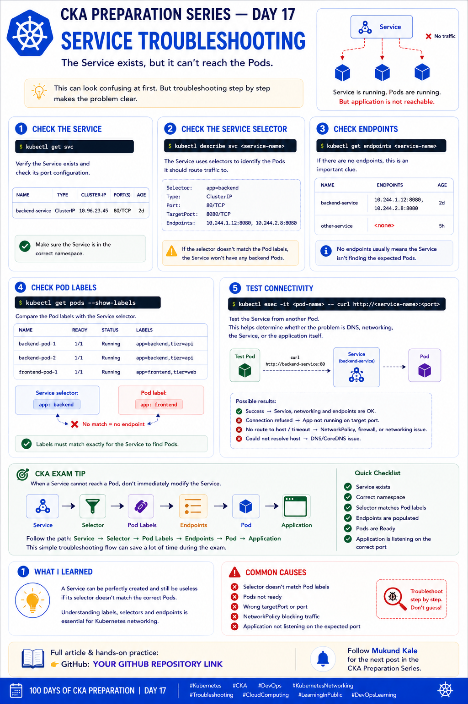

# 🚀 CKA Preparation Series — Day 17: Service Troubleshooting

Continuing my **CKA Preparation Series | Learning Kubernetes in Public**.

Today I focused on one of the most common Kubernetes networking troubleshooting scenarios:

> **“The Service exists, but it can't reach the Pods.”**

At first, this can be confusing. The Service exists, the Pods are running, but the application still isn't reachable.

The key is to troubleshoot the complete traffic path instead of immediately changing the Service.

---

## 📚 Table of Contents

* [The Problem](#-the-problem)
* [How a Service Routes Traffic](#-how-a-service-routes-traffic)
* [Step 1 — Check the Service](#-step-1--check-the-service)
* [Step 2 — Check the Service Selector](#-step-2--check-the-service-selector)
* [Step 3 — Check Endpoints](#-step-3--check-endpoints)
* [Step 4 — Check Pod Labels](#-step-4--check-pod-labels)
* [Step 5 — Check Pod Status](#-step-5--check-pod-status)
* [Step 6 — Test Connectivity](#-step-6--test-connectivity)
* [Step 7 — Check the Application](#-step-7--check-the-application)
* [Common Problems](#-common-problems)
* [CKA Exam Tip](#-cka-exam-tip)
* [Troubleshooting Flow](#-troubleshooting-flow)
* [Useful Commands](#-useful-commands)
* [Key Takeaways](#-key-takeaways)

---

# 🔹 The Problem

Imagine we have:

```text
Client Pod
    |
    v
Service
    |
    X
Backend Pod
```

The Service exists:

```bash
kubectl get svc
```

The backend Pods also exist:

```bash
kubectl get pods
```

But requests are failing.

Instead of guessing, we can troubleshoot the Service layer by layer.

---

# 🔹 How a Service Routes Traffic

A Kubernetes Service uses a **selector** to identify the Pods that should receive traffic.

The basic relationship is:

```text
Service
   |
   | selector
   v
Pod Labels
   |
   v
Endpoints
   |
   v
Backend Pods
```

For example, the Service might have:

```yaml
selector:
  app: backend
```

The target Pod needs to have:

```yaml
labels:
  app: backend
```

If the labels don't match, the Service cannot select the Pod.

---

# 🔍 Step 1 — Check the Service

Start by confirming that the Service exists:

```bash
kubectl get svc
```

For a specific namespace:

```bash
kubectl get svc -n <namespace>
```

Inspect the Service:

```bash
kubectl describe svc <service-name>
```

Check:

* Service type
* ClusterIP
* Port
* TargetPort
* Selector
* Endpoints

Example:

```text
Name:              backend-service
Type:              ClusterIP
IP:                10.96.100.10
Port:              80/TCP
TargetPort:        8080/TCP
Selector:          app=backend
Endpoints:         10.244.1.20:8080
```

If the Service has no endpoints, continue troubleshooting.

---

# 🔹 Step 2 — Check the Service Selector

Use:

```bash
kubectl describe svc <service-name>
```

Look for:

```text
Selector:
  app=backend
```

The selector tells Kubernetes which Pods should receive traffic.

For example:

```yaml
spec:
  selector:
    app: backend
```

The selector must match the labels on the intended Pods.

---

# 🔹 Step 3 — Check Endpoints

One of the most useful commands for Service troubleshooting is:

```bash
kubectl get endpoints <service-name>
```

Example:

```text
NAME              ENDPOINTS
backend-service   10.244.1.20:8080,10.244.1.21:8080
```

If you see:

```text
backend-service   <none>
```

that's an important clue.

It means the Service currently has no endpoints associated with it.

On modern Kubernetes clusters, EndpointSlices can also be inspected:

```bash
kubectl get endpointslices
```

Or:

```bash
kubectl get endpointslices -l kubernetes.io/service-name=<service-name>
```

---

# 🔹 Step 4 — Check Pod Labels

List Pods with their labels:

```bash
kubectl get pods --show-labels
```

Example:

```text
NAME       READY   STATUS    LABELS
backend    1/1     Running   app=backend
frontend   1/1     Running   app=frontend
```

Suppose the Service selector is:

```text
app=backend
```

The backend Pod has:

```text
app=backend
```

✅ Match

But if the Pod has:

```text
app=frontend
```

❌ No match

Therefore:

```text
Service selector
       ↓
    app=backend

Pod label
       ↓
    app=frontend

       ↓

    No Match

       ↓

No Endpoint
```

---

# 🔹 Step 5 — Check Pod Status

Even if labels match, check whether the target Pods are actually ready.

```bash
kubectl get pods -o wide
```

Look at:

```text
READY
STATUS
RESTARTS
IP
NODE
```

For more details:

```bash
kubectl describe pod <pod-name>
```

Check for:

* Container errors
* Readiness probe failures
* CrashLoopBackOff
* Image pull errors
* Scheduling issues
* Container ports
* Events

A Pod being `Running` does not necessarily mean the application is ready to receive Service traffic.

---

# 🔹 Step 6 — Test Connectivity

Once the Service and endpoints look correct, test connectivity from another Pod.

For example:

```bash
kubectl exec -it <client-pod> -- curl http://<service-name>:<port>
```

If DNS is not part of the test, you can also test the Service ClusterIP:

```bash
kubectl get svc <service-name>
```

Then:

```bash
kubectl exec -it <client-pod> -- curl http://<cluster-ip>:<port>
```

The exact command depends on the tools available inside the client container.

Some minimal container images may not have `curl`.

---

# 🔹 Step 7 — Check the Application

If:

```text
Service
   ↓
Selector
   ↓
Endpoints
   ↓
Connectivity
```

all look correct, the problem may be inside the application itself.

Check application logs:

```bash
kubectl logs <pod-name>
```

For multiple containers:

```bash
kubectl logs <pod-name> -c <container-name>
```

Also check the application port.

For example, if the application listens on:

```text
8080
```

the Service should generally route to the correct target port:

```yaml
ports:
  - port: 80
    targetPort: 8080
```

---

# ⚠️ Common Problems

## 1️⃣ Service Selector Doesn't Match Pod Labels

Service:

```yaml
selector:
  app: backend
```

Pod:

```yaml
labels:
  app: frontend
```

Result:

```text
No endpoints
```

---

## 2️⃣ Wrong TargetPort

Service:

```yaml
ports:
  - port: 80
    targetPort: 8080
```

But the application is actually listening on:

```text
9090
```

The Service may have endpoints, but traffic can still fail because it is being sent to the wrong port.

---

## 3️⃣ Pod Is Not Ready

A Pod may show:

```text
Running
```

but fail its readiness probe.

Check:

```bash
kubectl get pods
```

and:

```bash
kubectl describe pod <pod-name>
```

---

## 4️⃣ Wrong Namespace

A Service and Pod can have the same names in different namespaces.

Always check:

```bash
kubectl get svc -A
kubectl get pods -A
```

And when necessary:

```bash
kubectl get svc -n <namespace>
kubectl get pods -n <namespace>
```

---

## 5️⃣ Application Is Not Listening

The Service may be configured correctly, but the application itself may not be listening on the expected port.

Check logs:

```bash
kubectl logs <pod-name>
```

---

## 6️⃣ NetworkPolicy Blocks Traffic

If a NetworkPolicy is configured, it may prevent traffic from reaching the application.

Check:

```bash
kubectl get networkpolicy
```

Then inspect:

```bash
kubectl describe networkpolicy <policy-name>
```

---

# 🎯 CKA Exam Tip

When a Service cannot reach a Pod, don't immediately modify the Service.

Follow this path:

```text
Service
   ↓
Selector
   ↓
Pod Labels
   ↓
Endpoints
   ↓
Pod Status
   ↓
Port / TargetPort
   ↓
Application
```

This gives you a systematic troubleshooting process.

---

# 🔄 Troubleshooting Flow

A useful mental model:

```text
             Service Problem
                    |
                    v
             Does Service exist?
                    |
                    v
            Check Service selector
                    |
                    v
            Check Pod labels
                    |
             Match?
            /       \
          No         Yes
          |           |
          v           v
      Fix labels   Check endpoints
                      |
                 Endpoints exist?
                  /          \
                No            Yes
                |              |
                v              v
          Check selector    Test connectivity
          and Pod status         |
                                v
                         Check targetPort
                                |
                                v
                         Check application
                                |
                                v
                         Check NetworkPolicy
```

---

# 🧪 Hands-On Example

## Create a Backend Pod

```bash
kubectl run backend \
  --image=nginx \
  --labels="app=backend"
```

Check the Pod:

```bash
kubectl get pods --show-labels
```

---

## Create a Service

```yaml
apiVersion: v1
kind: Service
metadata:
  name: backend-service
spec:
  selector:
    app: backend
  ports:
    - port: 80
      targetPort: 80
```

Apply it:

```bash
kubectl apply -f service.yaml
```

---

## Check the Service

```bash
kubectl get svc backend-service
```

---

## Check Endpoints

```bash
kubectl get endpoints backend-service
```

Expected result should contain the backend Pod IP and port if the selector matches and the Pod is eligible.

---

## Introduce a Label Mismatch

Change the Pod label:

```bash
kubectl label pod backend app=frontend --overwrite
```

Now check:

```bash
kubectl get endpoints backend-service
```

The endpoint should disappear because:

```text
Service:
app=backend

Pod:
app=frontend
```

No match.

Restore the label:

```bash
kubectl label pod backend app=backend --overwrite
```

Check again:

```bash
kubectl get endpoints backend-service
```

This demonstrates how important **labels and selectors** are to Kubernetes Services.

---

# 🔧 Useful Commands

### Services

```bash
kubectl get svc
kubectl get svc -A
kubectl describe svc <service-name>
```

### Pods

```bash
kubectl get pods
kubectl get pods -o wide
kubectl get pods --show-labels
kubectl describe pod <pod-name>
```

### Endpoints

```bash
kubectl get endpoints
kubectl get endpoints <service-name>
```

### EndpointSlices

```bash
kubectl get endpointslices
```

### Logs

```bash
kubectl logs <pod-name>
```

### Test Connectivity

```bash
kubectl exec -it <pod-name> -- curl http://<service-name>:<port>
```

### NetworkPolicies

```bash
kubectl get networkpolicy
kubectl describe networkpolicy <policy-name>
```

---

# 🧠 Quick Revision

### Service

Provides a stable network endpoint for a group of Pods.

### Selector

Identifies which Pods the Service should route traffic to.

### Pod Labels

Must match the Service selector.

### Endpoints

Represent the backend addresses available behind the Service.

### `port`

The port exposed by the Service.

### `targetPort`

The port where traffic is sent on the selected backend Pods.

---

# 📌 Key Takeaways

The biggest lesson from today's troubleshooting practice:

> **A Service can exist and still have no usable backend Pods.**

When troubleshooting, always verify:

```text
Service
 ↓
Selector
 ↓
Pod Labels
 ↓
Endpoints
 ↓
Pod Readiness
 ↓
TargetPort
 ↓
Application
```

The most important commands I practiced were:

```bash
kubectl get svc
kubectl describe svc <service-name>
kubectl get endpoints <service-name>
kubectl get endpointslices
kubectl get pods --show-labels
kubectl describe pod <pod-name>
kubectl logs <pod-name>
kubectl exec -it <pod-name> -- curl http://<service-name>:<port>
```

Understanding this flow makes Kubernetes Service troubleshooting much more structured and much less dependent on guesswork.

---

# 📚 What I Learned

Today I learned that troubleshooting a Kubernetes Service isn't just about checking whether the Service exists.

I need to follow the complete path:

**Service → Selector → Pod Labels → Endpoints → Pod → Application**

A small selector mismatch can completely break connectivity even though both the Service and Pods appear to be running.

This is exactly the kind of troubleshooting mindset I want to build for the **CKA exam and real-world Kubernetes environments**.

---

# 🔗 Follow the CKA Journey

I'm continuing to learn Kubernetes by practicing each topic and documenting what I learn along the way.

📂 **GitHub — CKA Preparation Repository**

https://github.com/Mukund15kale/100DaysOfCKA

🔔 Follow **Mukund Kale** for the next post in the **CKA Preparation Series**.

---
```



---
---

## 🏷️ Tags

`#Kubernetes` `#CKA` `#CKAPreparation` `#DevOps` `#KubernetesNetworking` `#Troubleshooting` `#CloudComputing` `#LearningInPublic` `#DevOpsLearning` `#100DaysOfCKA`
