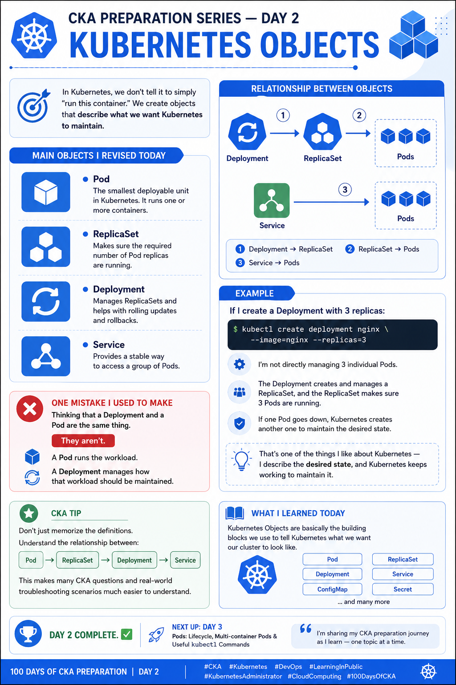

# CKA Preparation Series — Day 2: Kubernetes Objects

Day 2 of my **CKA preparation journey** focused on understanding **Kubernetes Objects**.

Instead of simply telling Kubernetes to "run this container," we create objects that describe the **desired state** we want Kubernetes to maintain.

## 📌 Topics Covered

### 🔹 Pod

The smallest deployable unit in Kubernetes. A Pod runs one or more containers.

### 🔹 ReplicaSet

Ensures that the required number of Pod replicas are running.

### 🔹 Deployment

Manages ReplicaSets and provides features such as rolling updates and rollbacks.

### 🔹 Service

Provides a stable way to access a group of Pods.

## 🔗 Understanding the Relationship

One of the key concepts I focused on today was how these objects work together:

```text
Deployment
    ↓
ReplicaSet
    ↓
Pods
```

And to access those Pods:

```text
Service
    ↓
Pods
```

For example:

```bash
kubectl create deployment nginx --image=nginx --replicas=3
```

With this command, I'm not directly managing three individual Pods.

The **Deployment** creates and manages a **ReplicaSet**, and the ReplicaSet ensures that three Pods are running.

If one Pod goes down, Kubernetes creates another one to maintain the desired state.

That's one of the things I like about Kubernetes:

> **I describe the desired state, and Kubernetes works continuously to maintain it.**

## 💡 Key Learning

One mistake I used to make was thinking that a **Deployment and a Pod are the same thing**.

They aren't.

* **Pod** → Runs the workload
* **ReplicaSet** → Maintains the desired number of Pods
* **Deployment** → Manages ReplicaSets and application updates
* **Service** → Provides stable network access to Pods

## 🎯 CKA Tip

Don't just memorize definitions.

Understand the relationship:

```text
Pod → ReplicaSet → Deployment
              ↑
           Service
              ↓
             Pods
```

Understanding these relationships makes many CKA questions and real-world troubleshooting scenarios much easier.

## 📚 What I Learned Today

Kubernetes Objects are the building blocks we use to describe what we want our cluster to look like.

**Day 2 complete. ✅**

Next up:

**Day 3 — Pods: Lifecycle, Multi-container Pods & Useful kubectl Commands**

I'm sharing my CKA preparation journey as I learn — one topic at a time.

---

## 🗂️ Repository Structure

```text
CKA-Preparation/
├── README.md
├── Day-01-Kubernetes-Architecture/
├── Day-02-Kubernetes-Objects/
│   ├── README.md
│   └── commands.md
├── Day-03-Pods/
└── images/
```

## 🔗 Useful Kubernetes Commands

```bash
# Create a Deployment
kubectl create deployment nginx --image=nginx --replicas=3

# View Deployments
kubectl get deployments

# View ReplicaSets
kubectl get replicasets

# View Pods
kubectl get pods

# View Services
kubectl get services

# Describe a Deployment
kubectl describe deployment nginx
```

## 🧠 CKA Focus

For the CKA, focus on understanding:

* Kubernetes Objects
* Desired State
* Pod and ReplicaSet relationship
* Deployment and ReplicaSet relationship
* Services and Pod selection
* Rolling Updates
* Rollbacks
* `kubectl` commands for inspecting resources

---

**CKA Preparation Series — Day 2/100**

#CKA #Kubernetes #DevOps #LearningInPublic #KubernetesAdministrator #CloudComputing #100DaysOfCKA

