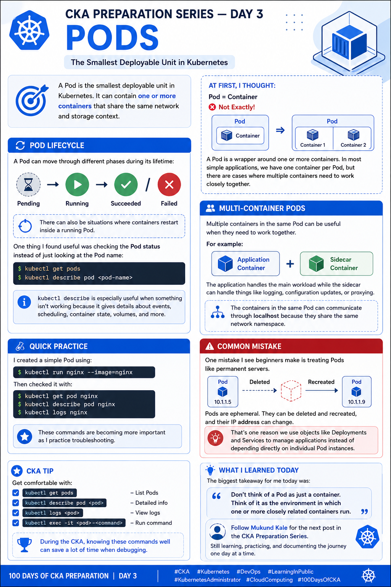

# Day 3 — Pods: Lifecycle, Multi-Container Pods & Useful kubectl Commands

Today I focused on **Pods**, one of the most important Kubernetes concepts for the CKA exam.

A **Pod is the smallest deployable unit in Kubernetes**. It can contain one or more containers that share the same network and storage context.

## 📌 What I Learned

### 🔹 Pod vs Container

One thing that became clearer today:

```text
Container ≠ Pod
```

A container runs the application, while a Pod provides the Kubernetes execution environment for one or more containers.

```text
Pod
├── Container
├── Shared Network
└── Shared Storage
```

A Pod can also contain multiple containers:

```text
Pod
├── Main Container
└── Sidecar Container
```

These containers share the same:

* Network namespace
* IP address
* Port space
* Volumes

---

## 🔄 Pod Lifecycle

I revised the different Pod phases:

```text
Pending
   ↓
Running
   ↓
Succeeded / Failed
```

### Pending

The Pod has been accepted by Kubernetes but one or more containers haven't started yet.

### Running

The Pod has been scheduled and at least one container is running or starting.

### Succeeded

All containers completed successfully.

### Failed

All containers terminated, and at least one container failed.

### Unknown

The state of the Pod couldn't be obtained, usually because of a communication problem with the node.

---

## 🚀 Creating a Pod

Using `kubectl run`:

```bash
kubectl run nginx --image=nginx
```

Check the Pod:

```bash
kubectl get pods
```

Get more information:

```bash
kubectl get pods -o wide
```

Describe the Pod:

```bash
kubectl describe pod nginx
```

---

## 📝 Generate a Pod Manifest

For the CKA, knowing how to quickly generate YAML is extremely useful.

```bash
kubectl run nginx --image=nginx --dry-run=client -o yaml > nginx.yaml
```

Then inspect the generated manifest:

```bash
cat nginx.yaml
```

Apply it:

```bash
kubectl apply -f nginx.yaml
```

---

## 🧰 Useful kubectl Commands

### List Pods

```bash
kubectl get pods
```

### Watch Pods

```bash
kubectl get pods -w
```

### Describe a Pod

```bash
kubectl describe pod nginx
```

### View Pod YAML

```bash
kubectl get pod nginx -o yaml
```

### View Pod Logs

```bash
kubectl logs nginx
```

### Execute a command inside a Pod

```bash
kubectl exec -it nginx -- /bin/bash
```

If Bash isn't available:

```bash
kubectl exec -it nginx -- /bin/sh
```

### Delete a Pod

```bash
kubectl delete pod nginx
```

---

## 🔥 Multi-Container Pods

Kubernetes allows multiple containers to run inside the same Pod.

For example:

```text
                 Pod
        ┌───────────────────┐
        │                   │
        │  Main Container   │
        │                   │
        │  Sidecar          │
        │  Container        │
        │                   │
        └───────────────────┘
```

A common pattern is a **sidecar container** that supports the main application.

Example:

```yaml
apiVersion: v1
kind: Pod
metadata:
  name: multi-container-pod
spec:
  containers:
    - name: main-container
      image: nginx

    - name: sidecar-container
      image: busybox
      command: ["sh", "-c", "while true; do echo Sidecar running; sleep 10; done"]
```

Both containers are part of the same Pod and share the Pod's network namespace.

---

## 💡 Important CKA Learning

One important thing I learned is that Kubernetes does **not** normally restart an individual Pod as a unit when it disappears.

Controllers such as a **Deployment** or **ReplicaSet** maintain the desired number of Pods.

For example:

```text
Deployment
     ↓
ReplicaSet
     ↓
   Pods
  ┌──┼──┐
 Pod Pod Pod
```

If a Pod managed by a ReplicaSet is deleted, the ReplicaSet creates a replacement.

---

## 🎯 CKA Tips

For the CKA, I want to be comfortable with:

* Creating Pods quickly
* Generating YAML with `--dry-run=client`
* Understanding Pod lifecycle
* Reading Pod status
* Using `kubectl describe`
* Checking logs
* Executing commands inside containers
* Working with multi-container Pods
* Understanding container restart behavior
* Troubleshooting Pending/Failed Pods

### Commands worth remembering

```bash
kubectl get pods
kubectl get pods -o wide
kubectl describe pod <pod-name>
kubectl logs <pod-name>
kubectl exec -it <pod-name> -- /bin/sh
kubectl delete pod <pod-name>

kubectl run <pod-name> --image=<image>

kubectl run <pod-name> \
  --image=<image> \
  --dry-run=client \
  -o yaml
```

---

## 📚 Key Takeaway

Today reinforced an important Kubernetes concept:

> **A Pod is the execution unit, while controllers such as Deployments and ReplicaSets are responsible for maintaining the desired state.**

Understanding Pods properly makes the next Kubernetes concepts much easier to understand.

**Day 3 complete. ✅**

Next up: **Day 4 — Deployments & Services**

I'm continuing to share my CKA preparation journey and hands-on practice one topic at a time.

---

## 📂 Repository Structure

```text
CKA-Preparation/
├── README.md
├── Day-01-Kubernetes-Architecture/
├── Day-02-Kubernetes-Objects/
├── Day-03-Pods/
│   ├── README.md
│   ├── pod.yaml
│   └── multi-container-pod.yaml
├── Day-04-Deployments-Services/
└── images/
```

## 🏷️ Tags

`#CKA` `#Kubernetes` `#DevOps` `#LearningInPublic` `#KubernetesAdministrator` `#CloudComputing` `#100DaysOfCKA`

