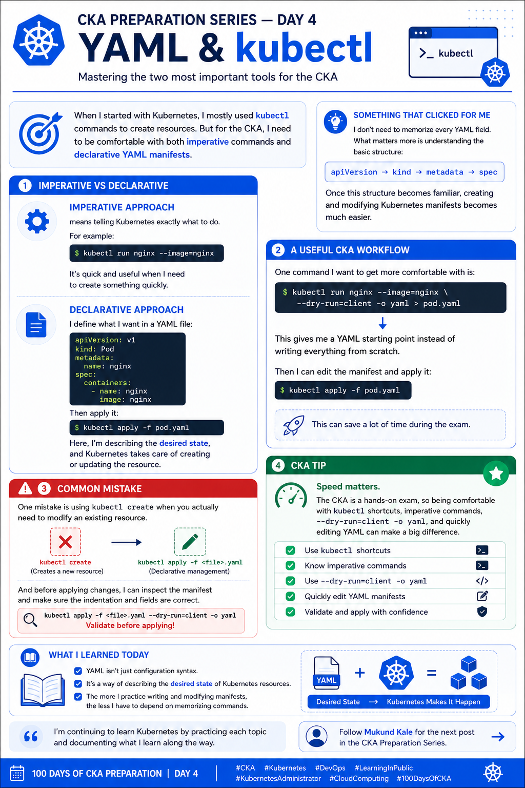

# 🚀 CKA Preparation Series — Day 4: YAML & kubectl

Day 4 of my **CKA preparation journey**.

Today I focused on something I'll be using throughout the entire CKA preparation: **YAML and kubectl**.

When I started with Kubernetes, I mostly used `kubectl` commands to create resources. But for the CKA, I need to be comfortable with both **imperative commands** and **declarative YAML manifests**.

---

## 🔹 Imperative vs Declarative

### Imperative Approach

The **imperative approach** means telling Kubernetes exactly what to do.

For example:

```bash
kubectl run nginx --image=nginx
```

It's quick and useful when I need to create something quickly.

### Declarative Approach

With the **declarative approach**, I define what I want in a YAML file.

Example:

```yaml
apiVersion: v1
kind: Pod
metadata:
  name: nginx
spec:
  containers:
    - name: nginx
      image: nginx
```

Then apply it:

```bash
kubectl apply -f pod.yaml
```

Here, I'm describing the **desired state**, and Kubernetes takes care of creating or updating the resource.

---

## 💡 Something That Clicked for Me

I don't need to memorize every YAML field.

What matters more is understanding the basic Kubernetes manifest structure:

```text
apiVersion
    ↓
kind
    ↓
metadata
    ↓
spec
```

Once this structure becomes familiar, creating and modifying Kubernetes manifests becomes much easier.

---

## 🧪 Useful CKA Workflow

One command I want to get more comfortable with is:

```bash
kubectl run nginx --image=nginx --dry-run=client -o yaml > pod.yaml
```

This generates a YAML starting point instead of writing everything from scratch.

I can then edit the manifest:

```bash
vi pod.yaml
```

And apply it:

```bash
kubectl apply -f pod.yaml
```

This workflow can save a lot of time during the CKA exam.

---

## 🔍 Inspecting Resources

After applying a manifest, I can verify the resource using:

```bash
kubectl get pods
```

For more details:

```bash
kubectl describe pod nginx
```

To see the complete YAML:

```bash
kubectl get pod nginx -o yaml
```

---

## ⚠️ Common Mistake

One mistake is using `kubectl create` when I actually need to modify an existing resource.

For declarative management, I should get comfortable with:

```bash
kubectl apply -f <file>.yaml
```

Before applying changes, I should also check:

* YAML indentation
* Resource `kind`
* `apiVersion`
* Required fields
* Container names
* Image names

---

## 🎯 CKA Tip

**Speed matters.**

The CKA is a hands-on exam, so being comfortable with:

* `kubectl` shortcuts
* Imperative commands
* `--dry-run=client`
* `-o yaml`
* YAML editing
* `kubectl apply`

can make a big difference.

Instead of spending time writing a manifest from scratch, I can generate a basic YAML and modify it according to the task.

---

## 📚 What I Learned Today

YAML isn't just configuration syntax.

It's a way of describing the **desired state** of Kubernetes resources.

The more I practice writing and modifying manifests, the less I have to depend on memorizing commands.

### Key commands from Day 4

```bash
# Create a Pod imperatively
kubectl run nginx --image=nginx

# Generate YAML without creating the resource
kubectl run nginx --image=nginx --dry-run=client -o yaml

# Save generated YAML
kubectl run nginx --image=nginx --dry-run=client -o yaml > pod.yaml

# Apply a YAML manifest
kubectl apply -f pod.yaml

# List resources
kubectl get pods

# Get detailed information
kubectl describe pod nginx

# View resource YAML
kubectl get pod nginx -o yaml
```

---

## 🧠 Day 4 Takeaway

> **Understand the desired state, know how to express it in YAML, and become fast with kubectl.**

I'm continuing to learn Kubernetes by practicing each topic and documenting what I learn along the way.



---

##

---

### 🏷️ Tags

`#CKA` `#Kubernetes` `#DevOps` `#LearningInPublic` `#KubernetesAdministrator` `#CloudComputing` `#100DaysOfCKA`
