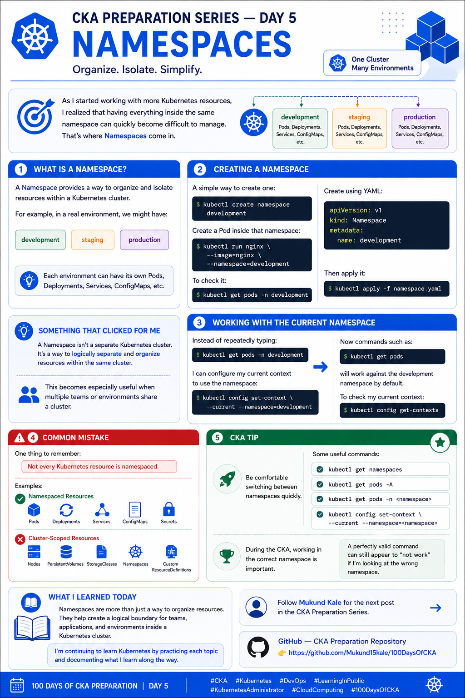

# 🚀 CKA Preparation Series — Day 5: Namespaces

Day 5 of my **CKA preparation journey**.

Today I focused on **Kubernetes Namespaces**.

As I started working with more Kubernetes resources, I realized that having everything inside the same namespace can quickly become difficult to manage.

That's where **Namespaces** come in.

---

## 🔹 What is a Namespace?

A Namespace provides a way to **organize and isolate resources within a Kubernetes cluster**.

For example, in a real environment, we might have:

```text
development
staging
production
```

Each environment can have its own:

* Pods
* Deployments
* Services
* ConfigMaps
* Secrets
* Other namespaced resources

Namespaces allow multiple teams or applications to share the same Kubernetes cluster while keeping their resources logically separated.

---

## 🧪 Creating a Namespace

A simple way to create a Namespace:

```bash
kubectl create namespace development
```

Verify it:

```bash
kubectl get namespaces
```

Or:

```bash
kubectl get ns
```

---

## 🚀 Creating a Pod in a Namespace

I can create a Pod inside the `development` Namespace:

```bash
kubectl run nginx \
  --image=nginx \
  --namespace=development
```

To check the Pod:

```bash
kubectl get pods -n development
```

I can also use the short form:

```bash
kubectl get pods -n development
```

---

## 📝 Creating a Namespace Using YAML

Namespaces can also be created declaratively.

Example:

```yaml
apiVersion: v1
kind: Namespace
metadata:
  name: development
```

Save it as:

```text
namespace.yaml
```

Then apply it:

```bash
kubectl apply -f namespace.yaml
```

Verify:

```bash
kubectl get namespace development
```

---

## 💡 Something That Clicked for Me

A Namespace is **not a separate Kubernetes cluster**.

It is a logical boundary used to organize and separate resources **within the same cluster**.

For example:

```text
Kubernetes Cluster
│
├── development
│   ├── Pods
│   ├── Deployments
│   └── Services
│
├── staging
│   ├── Pods
│   ├── Deployments
│   └── Services
│
└── production
    ├── Pods
    ├── Deployments
    └── Services
```

This becomes especially useful when multiple teams or environments share a cluster.

---

## 🔄 Working with the Current Namespace

Instead of repeatedly typing:

```bash
kubectl get pods -n development
```

I can configure my current context to use the `development` Namespace:

```bash
kubectl config set-context --current --namespace=development
```

Now:

```bash
kubectl get pods
```

will use the `development` Namespace by default.

To check the current context:

```bash
kubectl config get-contexts
```

---

## 🔍 Checking All Namespaces

To list Pods across **all Namespaces**:

```bash
kubectl get pods -A
```

This is particularly useful when troubleshooting because a resource may exist in a different Namespace than the one currently selected.

---

## ⚠️ Common Mistake

One important thing to remember:

> **Not every Kubernetes resource is namespaced.**

For example:

### Namespaced Resources

* Pods
* Deployments
* Services
* ConfigMaps
* Secrets
* ReplicaSets

### Cluster-Scoped Resources

* Nodes
* PersistentVolumes
* Namespaces
* StorageClasses

Understanding this distinction is important when working with `kubectl` and during the CKA exam.

---

## 🎯 CKA Tip

Be comfortable switching between Namespaces quickly.

These commands are worth remembering:

```bash
# List Namespaces
kubectl get namespaces

# List Pods in a specific Namespace
kubectl get pods -n <namespace>

# List resources across all Namespaces
kubectl get pods -A

# Set the current context's default Namespace
kubectl config set-context --current --namespace=<namespace>

# View Kubernetes contexts
kubectl config get-contexts
```

During the CKA, working in the **correct Namespace** is important.

A perfectly valid command can still appear to "not work" if I'm looking at the wrong Namespace.

---

## 🧠 Day 5 Takeaway

> **Always know which Namespace you're working in.**

Namespaces help create a logical boundary for teams, applications, and environments inside a Kubernetes cluster.

More importantly for the CKA, knowing how to quickly switch, inspect, and troubleshoot across Namespaces can save valuable time.

---

## 📚 What I Learned Today

Today I learned:

* What Kubernetes Namespaces are
* How to create a Namespace
* How to create resources inside a Namespace
* How to generate a Namespace using YAML
* How to switch the default Namespace for the current context
* How to list resources across all Namespaces
* The difference between namespaced and cluster-scoped resources

I'm continuing to learn Kubernetes by practicing each topic and documenting what I learn along the way.

**Day 5 complete. ✅**

---

## 📂 Repository Structure

```text
100DaysOfCKA/
├── Day-01-Kubernetes-Architecture/
├── Day-02-Kubernetes-Objects/
├── Day-03-Pods/
├── Day-04-YAML-kubectl/
├── Day-05-Namespaces/
│   ├── README.md
│   └── namespace.yaml
└── images/
    ├── day1.png
    ├── day2.png
    ├── day3.png
    ├── day4.png
    └── day5.png
```



---

## 🔗 Follow the Journey

Follow [**Mukund Kale**](https://www.linkedin.com/in/mukund15kale/) for the next post in the **CKA Preparation Series**.

📂 **GitHub — CKA Preparation Repository**

https://github.com/Mukund15kale/100DaysOfCKA

---

### 🏷️ Tags

`#CKA` `#Kubernetes` `#DevOps` `#LearningInPublic` `#KubernetesAdministrator` `#CloudComputing` `#100DaysOfCKA`
