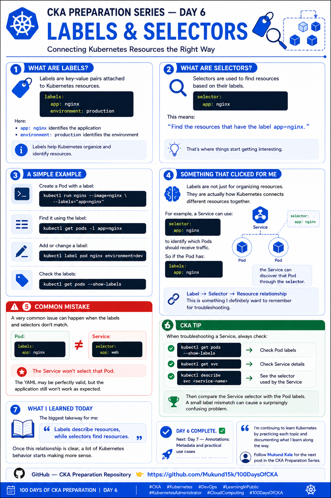

CKA Preparation Series — Day 6: Labels & Selectors

Day 6 of my **CKA preparation journey**.

Today I focused on **Labels and Selectors** in Kubernetes.

This topic looked pretty simple at first, but once I understood how Services, Deployments, and other Kubernetes objects use them, it became much more important.

---

## 🔹 What are Labels?

Labels are **key-value pairs** attached to Kubernetes resources.

For example:

```yaml
labels:
  app: nginx
  environment: production
```

Here:

* `app: nginx` identifies the application
* `environment: production` identifies the environment

Labels help Kubernetes organize, identify, and group resources.

---

## 🔹 What are Selectors?

Selectors are used to **find resources based on their labels**.

For example:

```yaml
selector:
  app: nginx
```

This means:

> "Find the resources that have the label `app=nginx`."

This relationship becomes especially important with Services, Deployments, and other Kubernetes controllers.

---

## 🧪 A Simple Example

I can create a Pod with a label:

```bash
kubectl run nginx --image=nginx --labels="app=nginx"
```

Then find it using the label:

```bash
kubectl get pods -l app=nginx
```

I can also add a label:

```bash
kubectl label pod nginx environment=dev
```

Check the labels:

```bash
kubectl get pods --show-labels
```

Or use a selector with multiple labels:

```bash
kubectl get pods -l app=nginx,environment=dev
```

---

## 💡 Something That Clicked for Me

Labels are not just for organizing resources.

They are an important mechanism Kubernetes uses to **select and associate resources**.

For example, a Service can use:

```yaml
selector:
  app: nginx
```

to select Pods with:

```yaml
labels:
  app: nginx
```

The relationship looks like this:

```text
Pod
└── Label: app=nginx
          ↓
     Service Selector
          ↓
      app=nginx
          ↓
    Service selects Pod
```

Understanding this relationship is especially useful when troubleshooting Services.

---

## 🔍 Checking Labels

Some useful commands:

### Show Pod labels

```bash
kubectl get pods --show-labels
```

### Filter using a selector

```bash
kubectl get pods -l app=nginx
```

### Show labels in YAML

```bash
kubectl get pod nginx -o yaml
```

### Add a label

```bash
kubectl label pod nginx environment=dev
```

### Change an existing label

```bash
kubectl label pod nginx environment=production --overwrite
```

### Remove a label

```bash
kubectl label pod nginx environment-
```

---

## ⚠️ Common Mistake

A very common issue happens when the labels and selectors don't match.

For example, the Pod has:

```yaml
labels:
  app: nginx
```

But the Service has:

```yaml
selector:
  app: web
```

The Service won't select that Pod.

The YAML can be completely valid, but the application may still not work as expected.

This is why checking labels and selectors should be part of the troubleshooting process.

---

## 🛠️ Troubleshooting Workflow

When troubleshooting a Service, I can check:

```bash
kubectl get pods --show-labels
```

Then:

```bash
kubectl get svc
```

And:

```bash
kubectl describe svc <service-name>
```

The important thing is to compare:

```text
Service Selector
       ↓
    app=nginx
       ↓
Pod Label
       ↓
    app=nginx
```

If they don't match, the Service won't select the Pod.

---


## 📚 What I Learned Today

Today's biggest takeaway:

**Labels describe resources, while selectors find resources.**

I also learned how to:

* Create resources with labels
* Add and modify labels
* Remove labels
* Filter resources using selectors
* Inspect labels with `kubectl`
* Troubleshoot Service-to-Pod selection

Once the **Label → Selector → Resource** relationship becomes clear, a lot of Kubernetes behavior starts making more sense.

**Day 6 complete. ✅**

Next: **Day 7 — Annotations: Metadata and Practical Use Cases**

I'm continuing to learn Kubernetes by practicing each topic and documenting what I learn along the way.

---

## 📂 Repository Structure

```text
100DaysOfCKA/
├── Day-01-Kubernetes-Architecture/
├── Day-02-Kubernetes-Objects/
├── Day-03-Pods/
├── Day-04-YAML-kubectl/
├── Day-05-Namespaces/
├── Day-06-Labels-Selectors/
│   ├── README.md
│   └── pod.yaml
├── Day-07-Annotations/
└── images/
    ├── day1.png
    ├── day2.png
    ├── day3.png
    ├── day4.png
    ├── day5.png
    └── day6.png
```



---

## 🔗 Follow the Journey

Follow [**Mukund Kale**](https://www.linkedin.com/in/Mukund15kale/) for the next post in the **CKA Preparation Series**.

📂 **GitHub — CKA Preparation Repository**

[https://github.com/Mukund15k/100DaysOfCKA](https://github.com/Mukund15k/100DaysOfCKA)

---

### 🏷️ Tags

`#CKA` `#Kubernetes` `#DevOps` `#LearningInPublic` `#KubernetesAdministrator` `#CloudComputing` `#100DaysOfCKA`
