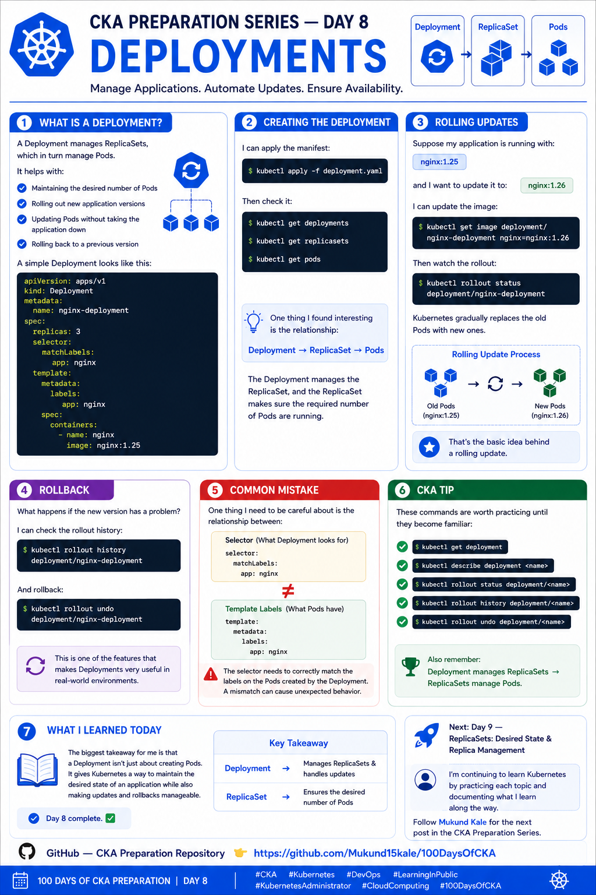

# 🚀 CKA Preparation Series — Day 8: Deployments

Day 8 of my **CKA preparation journey**.

Today I focused on **Kubernetes Deployments**.

After learning about Pods, Labels, and ReplicaSets, Deployments made much more sense to me.

A Deployment is a higher-level resource that helps manage **application Pods and their updates**.

---

## 🔹 What is a Deployment?

A Deployment manages **ReplicaSets**, which in turn manage **Pods**.

It helps with:

* Maintaining the desired number of Pods
* Rolling out new application versions
* Updating Pods without taking the application down
* Rolling back to a previous version

The basic relationship is:

```text
Deployment
     ↓
ReplicaSet
     ↓
   Pods
```

---

## 📝 Deployment Manifest

A simple Deployment looks like this:

```yaml
apiVersion: apps/v1
kind: Deployment
metadata:
  name: nginx-deployment
spec:
  replicas: 3
  selector:
    matchLabels:
      app: nginx
  template:
    metadata:
      labels:
        app: nginx
    spec:
      containers:
        - name: nginx
          image: nginx:1.25
```

One important thing to notice is the relationship between:

```yaml
selector:
  matchLabels:
    app: nginx
```

and:

```yaml
template:
  metadata:
    labels:
      app: nginx
```

The Deployment's selector must match the labels assigned to the Pods created from its template.

---

## 🧪 Creating the Deployment

I can apply the manifest using:

```bash
kubectl apply -f deployment.yaml
```

Then check the Deployment:

```bash
kubectl get deployments
```

Check the ReplicaSet:

```bash
kubectl get replicasets
```

And check the Pods:

```bash
kubectl get pods
```

I can also check everything together:

```bash
kubectl get deployment,replicaset,pods
```

---

## 🔄 Understanding the Relationship

When I create a Deployment with:

```yaml
replicas: 3
```

Kubernetes creates the following structure:

```text
Deployment
     │
     ▼
ReplicaSet
     │
     ├── Pod
     ├── Pod
     └── Pod
```

The Deployment manages the ReplicaSet, and the ReplicaSet ensures that the desired number of Pods are running.

If one of the Pods disappears, the ReplicaSet creates a replacement.

---

## 🔄 Rolling Updates

Suppose my application is running:

```text
nginx:1.25
```

and I want to update it to:

```text
nginx:1.26
```

I can update the image using:

```bash
kubectl set image deployment/nginx-deployment nginx=nginx:1.26
```

Then watch the rollout:

```bash
kubectl rollout status deployment/nginx-deployment
```

I can also check the Pods while the update is happening:

```bash
kubectl get pods
```

Kubernetes gradually replaces the old Pods with new ones.

This is the basic idea behind a **rolling update**.

---

## ↩️ Rolling Back a Deployment

What happens if the new version has a problem?

First, I can check the rollout history:

```bash
kubectl rollout history deployment/nginx-deployment
```

Then roll back to the previous revision:

```bash
kubectl rollout undo deployment/nginx-deployment
```

And verify the rollback:

```bash
kubectl rollout status deployment/nginx-deployment
```

This is one of the features that makes Deployments very useful in real-world environments.

---

## 🔍 Useful Deployment Commands

### List Deployments

```bash
kubectl get deployments
```

### Describe a Deployment

```bash
kubectl describe deployment <name>
```

### Check rollout status

```bash
kubectl rollout status deployment/<name>
```

### View rollout history

```bash
kubectl rollout history deployment/<name>
```

### Roll back

```bash
kubectl rollout undo deployment/<name>
```

### View Deployment YAML

```bash
kubectl get deployment <name> -o yaml
```

### Scale a Deployment

```bash
kubectl scale deployment <name> --replicas=5
```

---

## ⚠️ Common Mistake

One thing I need to be careful about is the relationship between:

```yaml
selector:
  matchLabels:
    app: nginx
```

and:

```yaml
template:
  metadata:
    labels:
      app: nginx
```

The selector needs to correctly match the labels on the Pods created by the Deployment.

A mismatch can cause the Deployment configuration to behave unexpectedly.

---

## 🎯 CKA Tip

These commands are worth practicing until they become familiar:

```bash
kubectl get deployment
kubectl describe deployment <name>
kubectl rollout status deployment/<name>
kubectl rollout history deployment/<name>
kubectl rollout undo deployment/<name>
kubectl scale deployment <name> --replicas=<number>
```

Also remember:

> **Deployment manages ReplicaSets → ReplicaSets manage Pods.**

Understanding this hierarchy makes Deployment troubleshooting much easier.

---

## 🧠 Day 8 Takeaway

The biggest takeaway for me is that a Deployment isn't just about creating Pods.

It gives Kubernetes a way to maintain the **desired state of an application** while making **updates, scaling, and rollbacks manageable**.

```text
Deployment
    ↓
Manages ReplicaSet
    ↓
Manages Pods
    ↓
Runs Application
```

---

## 📚 What I Learned Today

Today I learned:

* What a Deployment is
* How Deployments manage ReplicaSets
* How ReplicaSets maintain Pods
* How to create a Deployment using YAML
* How rolling updates work
* How to monitor a rollout
* How to view rollout history
* How to roll back a Deployment
* How to scale a Deployment
* Why Deployment selectors and Pod labels must match

**Day 8 complete. ✅**

Next: **Day 9 — ReplicaSets: Desired State & Replica Management**

I'm continuing to learn Kubernetes by practicing each topic and documenting what I learn along the way.

---

## 📂 Repository Structure

```text
100DaysOfCKA/
├── Day-01-Kubernetes-Architecture/
├── Day-02-Kubernetes-Objects/
├── Day-03-Pods/
├── Day-04-YAML-kubectl/
├── Day-05-Namespaces/
├── Day-06-Labels-Selectors/
├── Day-07-Annotations/
├── Day-08-Deployments/
│   ├── README.md
│   └── deployment.yaml
├── Day-09-ReplicaSets/
└── images/
    ├── day1.png
    ├── day2.png
    ├── day3.png
    ├── day4.png
    ├── day5.png
    ├── day6.png
    ├── day7.png
    └── day8.png
```



---

## 🔗 Follow the Journey

Follow **Mukund Kale** for the next post in the **CKA Preparation Series**.

📂 **GitHub — CKA Preparation Repository**

https://github.com/Mukund15kale/100DaysOfCKA

---

### 🏷️ Tags

`#CKA` `#Kubernetes` `#DevOps` `#LearningInPublic` `#KubernetesAdministrator` `#CloudComputing` `#100DaysOfCKA`
